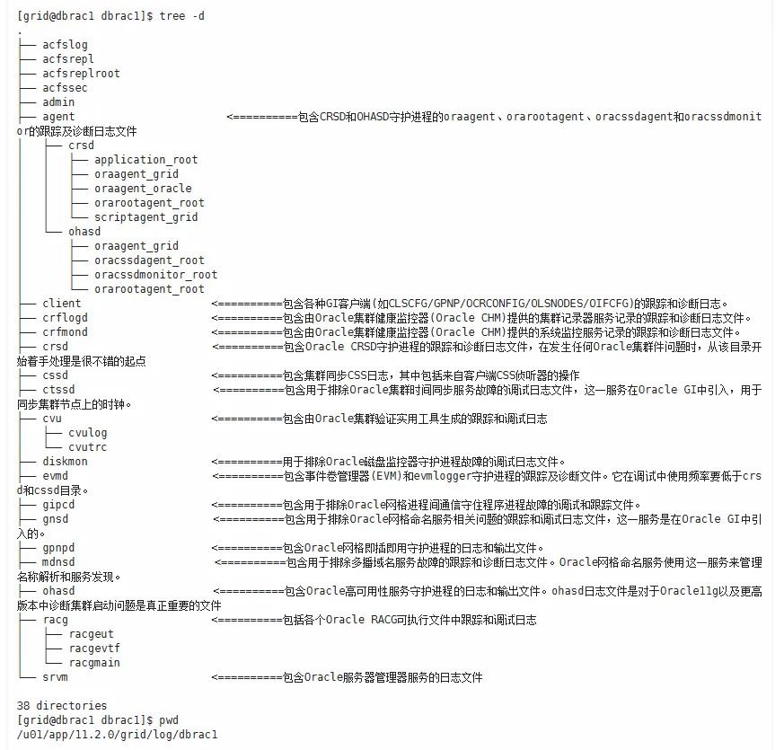
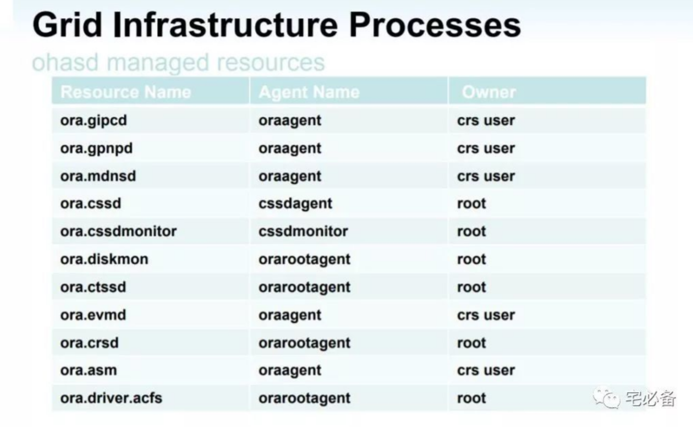

###  表空间扩容（OA）
查看表空间情况
```SQL
SELECT a.tablespace_name "表空间",
       total / (1024 * 1024) "总大小(MB)",
       free / (1024 * 1024) "剩余大小(MB)",
       (total - free) / (1024 * 1024) "已使用(MB)",
       round((total - free) / total, 4) * 100 "使用率%"
FROM (SELECT tablespace_name, sum(bytes) total
      FROM dba_data_files
      GROUP BY tablespace_name) a,
     (SELECT tablespace_name, sum(bytes) free
      FROM dba_free_space
      GROUP BY tablespace_name) b
WHERE a.tablespace_name = b.tablespace_name
AND a.tablespace_name = 'TS_OA_D';
```

查看磁盘组
```
su - grid
sqlplus / as sysasm

select instance_name from v$instance;

select GROUP_NUMBER,NAME,TOTAL_MB,FREE_MB from v$asm_diskgroup;
```

查看数据文件情况
```SQL
SELECT 
    tablespace_name,
    ROUND(bytes / 1024 / 1024, 2) AS size_mb,
    ROUND(maxbytes / 1024 / 1024, 2) AS max_size_mb,
    ROUND((bytes - df.used_space) / 1024 / 1024, 2) AS free_space_mb,
    ROUND(used_space / 1024 / 1024, 2) AS used_space_mb
FROM 
    dba_data_files df;
```

添加表空间文件
```SQL
ALTER TABLESPACE TS_OA_D 
ADD DATAFILE '+DATADG/zhfwdb/datafile/ts_oa_d07.dbf' SIZE 30G;
```

或者扩容（数据文件小于32G的情况）
```SQL
ALTER DATABASE DATAFILE '+DATADG/zhfwdb/datafile/ts_oa_d06.dbf' RESIZE 30G;
```

查看归档日志空间情况

``` sql
select name, space_limit/1024/1024/1024, space_used/1024/1024/1024 from v$recovery_file_dest;
```


### 查看数据
#### 人事处

DQZTM（当前状态码）为空 266
``` sql
select * from zfsoft_hrm. Overall where SFZH is null
```

PYLB（聘用类别） = 06 ，状态码依然为在职 44
``` sql
select * from zfsoft_hrm. Overall where PYLB = '06' and DQZTM = '11'
```

SFZH（证件号码为空） 150
``` sql
select * from zfsoft_hrm. Overall where SFZH is null
```

ZGXWM（最高学位码）学位码 669 个为空
``` sql
select * from zfsoft_hrm. Overall where ZGXWM is null and DQZTM = '11'
```

### 备份脚本
```shell 
#!/bin/bash 
retentionday=7
backdir=/backup/rman
backtime=`date +"%Y%m%d"`
deldir=`date -d "${retentionday} days ago" +%Y%m%d`
source /home/oracle/.bash_profile
if [ ! -d ${backdir}/${backtime} ];then
   mkdir -p ${backdir}/${backtime}
else
   rm -rf ${backdir}/${backtime}/*
fi
rman target / log=${backdir}/${backtime}/full_$backtime.log << EOF 
run{
allocate channel c1 device type disk;
allocate channel c2 device type disk;
allocate channel c3 device type disk;
allocate channel c4 device type disk;
sql 'alter system archive log current'; 
backup as compressed backupset full database format '${backdir}/${backtime}/DB_%d_%T_%U'; 
backup archivelog all format '${backdir}/${backtime}/ARCH_%d_%T_%s_%p' delete input;
backup current controlfile format '${backdir}/${backtime}/CTL_%d_%T_%s_%p';
release channel c1;
release channel c2;
release channel c3;
release channel c4;
crosscheck backup;
delete noprompt expired backup;
}
EOF
if [ -d ${backdir}/${deldir} ];then
   rm -rf ${backdir}/${deldir}
fi

```

### Oracle 安装环境
#### Packages
```
nutils-2.20.51.0.2-5.36.el6.x86_64
compat-libcap1-1.10-1 (x86_64)
compat-libstdc++-33-3.2.3-69.el6 (x86_64)
compat-libstdc++-33-3.2.3-69.el6.i686
e2fsprogs-1.41.12-14.el6.x86_64
e2fsprogs-libs-1.41.12-14.el6.x86_64
glibc-2.12-1.107.el6.i686
glibc-2.12-1.107.el6.x86_64
glibc-devel-2.12-1.107.el6.i686
glibc-devel-2.12-1.107.el6.x86_64
ksh
libaio-0.3.107-10.el6 (x86_64)
libaio-0.3.107-10.el6.i686
libaio-devel-0.3.107-10.el6 (x86_64)
libaio-devel-0.3.107-10.el6.i686
libX11-1.5.0-4.el6.i686
libX11-1.5.0-4.el6.x86_64
libXau-1.0.6-4.el6.i686
libXau-1.0.6-4.el6.x86_64
libXi-1.6.1-3.el6.i686
libXi-1.6.1-3.el6.x86_64
libXtst-1.2.1-2.el6.i686
libXtst-1.2.1-2.el6.x86_64
libXrender (i686)
libXrender (x86_64)
libXrender-devel (i686)
libXrender-devel (x86_64)
libgcc-4.4.7-3.el6.i686
libgcc-4.4.7-3.el6.x86_64
libstdc++-4.4.7-3.el6.i686
libstdc++-4.4.7-3.el6.x86_64
libstdc++-devel-4.4.7-3.el6.i686
libstdc++-devel-4.4.7-3.el6.x86_64
libxcb-1.8.1-1.el6.i686
libxcb-1.8.1-1.el6.x86_64
make-3.81-20.el6.x86_64
net-tools-1.60-110.el6_2.x86_64 (for Oracle RAC and Oracle
Clusterware)
nfs-utils-1.2.3-36.el6.x86_64 (for Oracle ACFS)
smartmontools-5.43-1.el6.x86_64
sysstat-9.0.4-20.el6.x86_64
```
> cite from *database-installation-guide-linux.pdf* page 64

#### Install command
``` shell
yum install -y bc \
binutils \
compat-libcap1 \
compat-libstdc++-33-3.2.3-69.el6.i686 \
e2fsprogs \
e2fsprogs-libs \
glibc \
glibc-devel \
ksh \
libaio \
libaio-devel \
libX11 \
libXau \
libXi \
libXtst \
libXrender \
libXrender-devel \
libgcc \
libstdc++ \
libstdc++-devel \
libxcb \
make \
smartmontools \
sysstat
```

#### Confirming Host Name Resolution
```
modified /etc/hosts and /etc/sysconfig/network to change hostname.
```

#### Required Operating System Groups and Users

Identifying an Oracle Software Owner User Account as follow:
uid=601(oracle) gid=501(oinstall) groups=501(oinstall),502(dba)

``` shell
groupadd oinstall -g 501
groupadd dba -g 502
useradd oracle -u 601 -g oinstall -G dba
```

#### Display Evirenment
Set the installation software owner user (grid, oracle) default file mode creationmask (umask) to 022,it usually 022.
If you are not installing the software on the local system, then enter a commandsimilar to the following to direct X applications to display on the local system:

```
export DISPLAY=local_host:0.0

setenv DISPLAY local_host:0.0
```


### Oracle 运行日志位置
```
/u01/app/oracle/diag/rdbms/oradb/oradb2/trace/alert_oradb2.log
```
Or
```
OA：vim /u01/app/oracle/diag/rdbms/zhfwdb/zhfwdb1/trace/alert_zhfwdb1.log
```

### 集群管理

#### 本地、集群资源管理
```
srvctl start instance -d ywkdb -i ywkdb1
srvctl start database -d urpdb
```

[https://www.jianshu.com/p/62d92909ce75](https://www.jianshu.com/p/62d92909ce75)

#### 集群资源检查
```
cd /u01/app/11.2.0/grid/bin
./crsctl status resource -t
./crs_stat
```
#### 常用命令
```
./crs_stat -t
ora.ARCHDG.dg  ora....up.type ONLINE    ONLINE    rac1        
ora.CRSDG.dg   ora....up.type ONLINE    ONLINE    rac1        
ora.DATADG.dg  ora....up.type ONLINE    ONLINE    rac1        
ora....ER.lsnr ora....er.type ONLINE    ONLINE    rac1        
ora....N1.lsnr ora....er.type ONLINE    ONLINE    rac1        
ora.asm        ora.asm.type   ONLINE    ONLINE    rac1        
ora.eons       ora.eons.type  ONLINE    ONLINE    rac1        
ora.gsd        ora.gsd.type   OFFLINE   OFFLINE               
ora.kfptdb.db  ora....se.type ONLINE    ONLINE    rac1        
ora....network ora....rk.type ONLINE    ONLINE    rac1        
ora.oc4j       ora.oc4j.type  OFFLINE   OFFLINE               
ora.ons        ora.ons.type   ONLINE    ONLINE    rac1        
ora....SM1.asm application    ONLINE    ONLINE    rac1        
ora....C1.lsnr application    ONLINE    ONLINE    rac1        
ora.rac1.gsd   application    OFFLINE   OFFLINE               
ora.rac1.ons   application    ONLINE    ONLINE    rac1        
ora.rac1.vip   ora....t1.type ONLINE    ONLINE    rac1        
ora....SM2.asm application    ONLINE    ONLINE    rac2        
ora....C2.lsnr application    ONLINE    ONLINE    rac2        
ora.rac2.gsd   application    OFFLINE   OFFLINE               
ora.rac2.ons   application    ONLINE    ONLINE    rac2        
ora.rac2.vip   ora....t1.type ONLINE    ONLINE    rac2        
ora.scan1.vip  ora....ip.type ONLINE    ONLINE    rac1        
ora.zhfwdb.db  ora....se.type ONLINE    ONLINE    rac1        

./crsctl status resource -t
--------------------------------------------------------------------------------
NAME           TARGET  STATE        SERVER                   STATE_DETAILS       
--------------------------------------------------------------------------------
Local Resources
--------------------------------------------------------------------------------
ora.ARCHDG.dg
               ONLINE  ONLINE       rac1                                         
               ONLINE  ONLINE       rac2                                         
ora.CRSDG.dg
               ONLINE  ONLINE       rac1                                         
               ONLINE  ONLINE       rac2                                         
ora.DATADG.dg
               ONLINE  ONLINE       rac1                                         
               ONLINE  ONLINE       rac2                                         
ora.LISTENER.lsnr
               ONLINE  ONLINE       rac1                                         
               ONLINE  ONLINE       rac2                                         
ora.asm
               ONLINE  ONLINE       rac1                     Started             
               ONLINE  ONLINE       rac2                     Started             
ora.eons
               ONLINE  ONLINE       rac1                                         
               ONLINE  ONLINE       rac2                                         
ora.gsd
               OFFLINE OFFLINE      rac1                                         
               OFFLINE OFFLINE      rac2                                         
ora.net1.network
               ONLINE  ONLINE       rac1                                         
               ONLINE  ONLINE       rac2                                         
ora.ons
               ONLINE  ONLINE       rac1                                         
               ONLINE  ONLINE       rac2                                         
--------------------------------------------------------------------------------
Cluster Resources
--------------------------------------------------------------------------------
ora.LISTENER_SCAN1.lsnr
      1        ONLINE  ONLINE       rac1                                         
ora.kfptdb.db
      1        ONLINE  ONLINE       rac1                     Open                
      2        ONLINE  ONLINE       rac2                     Open                
ora.oc4j
      1        OFFLINE OFFLINE                                                   
ora.rac1.vip
      1        ONLINE  ONLINE       rac1                                         
ora.rac2.vip
      1        ONLINE  ONLINE       rac2                                         
ora.scan1.vip
      1        ONLINE  ONLINE       rac1                                         
ora.zhfwdb.db
      1        ONLINE  ONLINE       rac1                     Open                
      2        ONLINE  ONLINE       rac2                     Open                

```

#### 集群运行日志 ：

/u01/app/oracle/diag/rdbms/oradb/oradb1/trace/alert_oradb1.log
/u01/app/oracle/diag/rdbms/oradb/oradb2/trace/alert_oradb2.log  
  
#### 常用资源解释

Event Management (EVM)、Cluster Synchronization Services (CSS)、Cluster Ready Service (CRS) 。

Oracle Cluster Service（OCS）


	11gR2 Clusterware and Grid Home - What You Need to Know
	11gR2 Clusterware Key Facts
	11gR2 Clusterware is required to be up and running prior to installing a 11gR2 Real Application Clusters database.
	The GRID home consists of the Oracle Clusterware and ASM.  ASM should not be in a separate home.
	The 11gR2 Clusterware can be installed in "Standalone" mode for ASM and/or "Oracle Restart" single node support. This clusterware is a subset of the full clusterware described in this document.
	The 11gR2 Clusterware can be run by itself or on top of vendor clusterware.  See the certification matrix for certified combinations. Ref: Note: 184875.1 "How To Check The Certification Matrix for Real Application Clusters"
	The GRID Home and the RAC/DB Home must be installed in different locations.
	The 11gR2 Clusterware requires a shared OCR files and voting files.  These can be stored on ASM or a cluster filesystem.
	The OCR is backed up automatically every 4 hours to <GRID_HOME>/cdata/<clustername>/ and can be restored via ocrconfig. 
	The voting file is backed up into the OCR at every configuration change and can be restored via crsctl. 
	The 11gR2 Clusterware requires at least one private network for inter-node communication and at least one public network for external communication.  Several virtual IPs need to be registered with DNS.  This includes the node VIPs (one per node), SCAN VIPs (three).  This can be done manually via your network administrator or optionally you could configure the "GNS" (Grid Naming Service) in the Oracle clusterware to handle this for you (note that GNS requires its own VIP).  
	A SCAN (Single Client Access Name) is provided to clients to connect to.  For more information on SCAN see Note: 887522.1
	The root.sh script at the end of the clusterware installation starts the clusterware stack.  For information on troubleshooting root.sh issues see Note: 1053970.1
	Only one set of clusterware daemons can be running per node. 
	On Unix, the clusterware stack is started via the init.ohasd script referenced in /etc/inittab with "respawn".
	A node can be evicted (rebooted) if a node is deemed to be unhealthy.  This is done so that the health of the entire cluster can be maintained.  For more information on this see: Note: 1050693.1"Troubleshooting 11.2 Clusterware Node Evictions (Reboots)"
	Either have vendor time synchronization software (like NTP) fully configured and running or have it not configured at all and let CTSS handle time synchronization.  See Note: 1054006.1 for more information.
	If installing DB homes for a lower version, you will need to pin the nodes in the clusterware or you will see ORA-29702 errors.  See Note 946332.1 and Note:948456.1 for more information.
	The clusterware stack can be started by either booting the machine, running "crsctl start crs" to start the clusterware stack, or by running "crsctl start cluster" to start the clusterware on all nodes.  Note that crsctl is in the <GRID_HOME>/bin directory.  Note that "crsctl start cluster" will only work if ohasd is running.
	The clusterware stack can be stopped by either shutting down the machine, running "crsctl stop crs" to stop the clusterware stack, or by running "crsctl stop cluster" to stop the clusterware on all nodes.  Note that crsctl is in the <GRID_HOME>/bin directory.
	Killing clusterware daemons is not supported.
	Instance is now part of .db resources in "crsctl stat res -t" output, there is no separate .inst resource for 11gR2 instance.
	Note that it is also a good idea to follow the RAC Assurance best practices in Note: 810394.1
	
	Clusterware Startup Sequence
	The following is the Clusterware startup sequence (image from the "Oracle Clusterware Administration and Deployment Guide):
		
	Don't let this picture scare you too much.  You aren't responsible for managing all of these processes, that is the Clusterware's job!
	
	Short summary of the startup sequence: INIT spawns init.ohasd (with respawn) which in turn starts the OHASD process (Oracle High Availability Services Daemon).  This daemon spawns 4 processes.
		
	Level 1: OHASD Spawns:
	
	cssdagent - Agent responsible for spawning CSSD.
	orarootagent - Agent responsible for managing all root owned ohasd resources.
	oraagent - Agent responsible for managing all oracle owned ohasd resources.
	cssdmonitor - Monitors CSSD and node health (along wth the cssdagent).
	Level 2: OHASD rootagent spawns:
	
	CRSD - Primary daemon responsible for managing cluster resources.
	CTSSD - Cluster Time Synchronization Services Daemon
	Diskmon
	ACFS (ASM Cluster File System) Drivers 
		
	Level 2: OHASD oraagent spawns:
	
	MDNSD - Used for DNS lookup
	GIPCD - Used for inter-process and inter-node communication
	GPNPD - Grid Plug & Play Profile Daemon
	EVMD - Event Monitor Daemon
	ASM - Resource for monitoring ASM instances
			
	Level 3: CRSD spawns:
	
	orarootagent - Agent responsible for managing all root owned crsd resources.
	oraagent - Agent responsible for managing all oracle owned crsd resources.
	
	
	Level 4: CRSD rootagent spawns:
	
	Network resource - To monitor the public network
	SCAN VIP(s) - Single Client Access Name Virtual IPs
	Node VIPs - One per node
	ACFS Registery - For mounting ASM Cluster File System
	GNS VIP (optional) - VIP for GNS
	
	
	
	Level 4: CRSD oraagent spawns:
	
	ASM Resouce - ASM Instance(s) resource
	Diskgroup - Used for managing/monitoring ASM diskgroups.  
	DB Resource - Used for monitoring and managing the DB and instances
	SCAN Listener - Listener for single client access name, listening on SCAN VIP
	Listener - Node listener listening on the Node VIP
	Services - Used for monitoring and managing services
	ONS - Oracle Notification Service
	eONS - Enhanced Oracle Notification Service
	GSD - For 9i backward compatibility
	GNS (optional) - Grid Naming Service - Performs name resolution
	This image shows the various levels more clearly:

#### oracle rac的关闭：

在每一台上面执行：
```
/u01/app/11.2.0/grid/bin/crsctl stop crs -f
```

[https://blog.csdn.net/weixin_42382944/article/details/116362583](https://blog.csdn.net/weixin_42382944/article/details/116362583)

如果rac未被正常关闭，比如直接reboot系统，则需要手动启动rac

```
/u01/app/11.2.0/grid/bin/crsctl start crs
```
### Oracle 脚本调用
windows下使用bat运行脚本：

``` shell
sqlplus zfsoft_im/im_2B2FM3333E@10.20.20.148:1521/oradb @dbspace.sql
pause
```


linux

``` shell
sqlplus zfsoft_im/im_2B2FM3333E@10.20.20.148:1521/oradb<EOF
select * from v$log;
EOF
```


SqlFile like this:
```sql 
select name, space_limit/1024/1024/1024, space_used/1024/1024/1024 from v$recovery_file_dest;
```
### 存储与 multipath 网址与学习
iscsi
[https://www.linuxmingling.com/article/260965.html](https://www.linuxmingling.com/article/260965.html)

multipath
[https://blog.csdn.net/sudahai102448567/article/details/111595748](https://blog.csdn.net/sudahai102448567/article/details/111595748)

udev
[http://t.zoukankan.com/hellokitty2-p-9521340.html](http://t.zoukankan.com/hellokitty2-p-9521340.html)

asm
[https://blog.51cto.com/cndba/5641120](https://blog.51cto.com/cndba/5641120)

oracle 11gR2 asm不能启动的处理方法
[http://blog.if98.com/328131696/manage/35870.html](http://blog.if98.com/328131696/manage/35870.html)

multipath
[https://blog.csdn.net/holandstone/article/details/7050234](https://blog.csdn.net/holandstone/article/details/7050234)

启动和停止rac
[https://www.qycn.com/xzx/article/13089.html](https://www.qycn.com/xzx/article/13089.html)

ORACLE11G crsctl.bin,Oracle11g RAC启动关闭情况大概总结
[https://blog.csdn.net/weixin_42382944/article/details/116362583](https://blog.csdn.net/weixin_42382944/article/details/116362583)

rman
[https://m.yisu.com/zixun/260826.html](https://m.yisu.com/zixun/260826.html)


### ISCSI 操作
10.20.20.158 上检查 iscsi 的 session
[ root@jwdb2 ~]# iscsiadm -m session
tcp: [1] 10.20.21.52:3260,1 iqn. 2018-01. Com. H 3 c. Onestor: 4821 e 82 b 3 c 2349 f 59 eba 7 b 3178168 a 27 (non-flash)

10.20.20.154 上进行设备发现
[ root@jwdb1 ~]# iscsiadm -m discovery -t st -p 10.20.21.52:3260
10.20.21.52:3260,1 iqn. 2018-01. Com. H 3 c. Onestor: 4821 e 82 b 3 c 2349 f 59 eba 7 b 3178168 a 27

10.20.20.154 上进行节点登录并检查 session
[ root@jwdb1 ~]# iscsiadm -m node -T iqn. 2018-01. Com. H 3 c. Onestor: 4821 e 82 b 3 c 2349 f 59 eba 7 b 3178168 a 27 -p 10.20.21.52:3260 -l
Logging in to [iface: default, target: iqn. 2018-01. Com. H 3 c. Onestor: 4821 e 82 b 3 c 2349 f 59 eba 7 b 3178168 a 27, portal: 10.20.21.52,3260] (multiple)
Login to [iface: default, target: iqn. 2018-01. Com. H 3 c. Onestor: 4821 e 82 b 3 c 2349 f 59 eba 7 b 3178168 a 27, portal: 10.20.21.52,3260] successful.
[ root@jwdb1 ~]# iscsiadm -m session
tcp: [2] 10.20.21.52:3260,1 iqn. 2018-01. Com. H 3 c. Onestor: 4821 e 82 b 3 c 2349 f 59 eba 7 b 3178168 a 27 (non-flash)

检查已经挂上
[ root@jwdb1 ~]# lsblk
NAME            MAJ: MIN RM   SIZE RO TYPE  MOUNTPOINT
sda               8:0    0 446.6 G  0 disk
├─sda 1            8:1    0   200 M  0 part  /boot/efi
├─sda 2            8:2    0     1 G  0 part  /boot
└─sda 3            8:3    0 445.4 G  0 part
├─centos-root 253:0    0   100 G  0 lvm   /
├─centos-swap 253:1    0    32 G  0 lvm   [SWAP]
└─centos-u 01  253:2    0 313.4 G  0 lvm   /u 01
sdb               8:16   0    30 G  0 disk
└─orasys 01      253:3    0    30 G  0 mpath
sdc               8:32   0     2 T  0 disk
└─oradata 01     253:4    0     2 T  0 mpath
sdd               8:48   0   1.1 T  0 disk
└─orafra 01      253:5    0   1.1 T  0 mpath
sde               8:64   0    30 G  0 disk
└─orasys 02      253:6    0    30 G  0 mpath
sdf               8:80   0   1.1 T  0 disk
└─orabak 01      253:7    0   1.1 T  0 mpath
sdg               8:96   0    30 G  0 disk
└─orasys 03      253:8    0    30 G  0 mpath

格式化路径，检测路径，合并路径 (v 2)，查看多路径详情 blacklist、whitelist 和设备 wwid (v 3)
[ root@jwdb1 ~]# multipath -v2
[ root@jwdb1 ~]# multipath -v3
``` log
Dec 16 17:37:19 | set open fds limit to 1048576/1048576
Dec 16 17:37:19 | loading /lib 64/multipath/libcheckdirectio. So checker
Dec 16 17:37:19 | loading /lib 64/multipath/libprioconst. So prioritizer
Dec 16 17:37:19 | sda: not found in pathvec
Dec 16 17:37:19 | sda: mask = 0 x 3 f
Dec 16 17:37:19 | sda: dev_t = 8:0
Dec 16 17:37:19 | sda: size = 936640512
Dec 16 17:37:19 | sda: vendor = AVAGO   
Dec 16 17:37:19 | sda: product = MR 9361-8 i       
Dec 16 17:37:19 | sda: rev = 4.68
Dec 16 17:37:19 | sda: h:b:t: l = 0:2:0:0
Dec 16 17:37:19 | sda: path state = running

Dec 16 17:37:19 | sda: 58303 cyl, 255 heads, 63 sectors/track, start at 0
Dec 16 17:37:19 | sda: serial = 009 a 714615844 fdb 2 a 50884111 b 00506
Dec 16 17:37:19 | sda: get_state
Dec 16 17:37:19 | sda: detect_checker = 1 (config file default)
Dec 16 17:37:19 | sda: path checker = directio (internal default)
Dec 16 17:37:19 | sda: checker timeout = 90000 ms (sysfs setting)
Dec 16 17:37:19 | directio: starting new request
Dec 16 17:37:19 | directio: io finished 4096/0
Dec 16 17:37:19 | sda: directio state = up
Dec 16 17:37:19 | sda: uid_attribute = ID_SERIAL (internal default)
Dec 16 17:37:19 | sda: uid = 3600605 b 0114188502 adb 4 f 841546719 a (udev)
Dec 16 17:37:19 | (null): (3600605 b 0114188502 adb 4 f 841546719 a) wwid blacklisted
Dec 16 17:37:19 | directio checker refcount 1
Dec 16 17:37:19 | sdg: not found in pathvec
Dec 16 17:37:19 | sdg: mask = 0 x 3 f
Dec 16 17:37:19 | sdg: dev_t = 8:96
Dec 16 17:37:19 | sdg: size = 62914560
Dec 16 17:37:19 | sdg: vendor = IET     
Dec 16 17:37:19 | sdg: product = VIRTUAL-DISK    
Dec 16 17:37:19 | sdg: rev = 0001
Dec 16 17:37:19 | sdg: h:b:t: l = 17:0:0:1
Dec 16 17:37:19 | sdg: tgt_node_name = iqn. 2018-01. Com. H 3 c. Onestor: 4821 e 82 b 3 c 2349 f 59 eba 7 b 3178168 a 27
Dec 16 17:37:19 | sdg: path state = running

Dec 16 17:37:19 | sdg: 30720 cyl, 64 heads, 32 sectors/track, start at 0
Dec 16 17:37:19 | sdg: serial =             beaf 51218955625329277333
Dec 16 17:37:19 | sdg: get_state
Dec 16 17:37:19 | sdg: detect_checker = 1 (config file default)
Dec 16 17:37:19 | sdg: path checker = directio (internal default)
Dec 16 17:37:19 | sdg: checker timeout = 30000 ms (sysfs setting)
Dec 16 17:37:19 | directio: starting new request
Dec 16 17:37:19 | directio: io finished 4096/0
Dec 16 17:37:19 | sdg: directio state = up
Dec 16 17:37:19 | sdg: uid_attribute = ID_SERIAL (internal default)
Dec 16 17:37:19 | sdg: uid = 360000000000000000 e 000000 f 65 dbc 4 c (udev)
Dec 16 17:37:19 | sdg: detect_prio = 1 (config file default)
Dec 16 17:37:19 | sdg: prio = const (internal default)
Dec 16 17:37:19 | sdg: prio args =  (internal default)
Dec 16 17:37:19 | sdg: const prio = 1
Dec 16 17:37:19 | sdf: not found in pathvec
Dec 16 17:37:19 | sdf: mask = 0 x 3 f
Dec 16 17:37:19 | sdf: dev_t = 8:80
Dec 16 17:37:19 | sdf: size = 2362232012
Dec 16 17:37:19 | sdf: vendor = IET     
Dec 16 17:37:19 | sdf: product = VIRTUAL-DISK    
Dec 16 17:37:19 | sdf: rev = 0001
Dec 16 17:37:19 | sdf: h:b:t: l = 17:0:0:2
Dec 16 17:37:19 | sdf: tgt_node_name = iqn. 2018-01. Com. H 3 c. Onestor: 4821 e 82 b 3 c 2349 f 59 eba 7 b 3178168 a 27
Dec 16 17:37:19 | sdf: path state = running

Dec 16 17:37:19 | sdf: 65535 cyl, 255 heads, 63 sectors/track, start at 0
Dec 16 17:37:19 | sdf: serial =             beaf 51218305856645433232
Dec 16 17:37:19 | sdf: get_state
Dec 16 17:37:19 | sdf: detect_checker = 1 (config file default)
Dec 16 17:37:19 | sdf: path checker = directio (internal default)
Dec 16 17:37:19 | sdf: checker timeout = 30000 ms (sysfs setting)
Dec 16 17:37:19 | directio: starting new request
Dec 16 17:37:19 | directio: io finished 2048/0
Dec 16 17:37:19 | sdf: directio state = up
Dec 16 17:37:19 | sdf: uid_attribute = ID_SERIAL (internal default)
Dec 16 17:37:19 | sdf: uid = 360000000000000000 e 000000 e 6 c 78 a 47 (udev)
Dec 16 17:37:19 | sdf: detect_prio = 1 (config file default)
Dec 16 17:37:19 | sdf: prio = const (internal default)
Dec 16 17:37:19 | sdf: prio args =  (internal default)
Dec 16 17:37:19 | sdf: const prio = 1
Dec 16 17:37:19 | sde: not found in pathvec
Dec 16 17:37:19 | sde: mask = 0 x 3 f
Dec 16 17:37:19 | sde: dev_t = 8:64
Dec 16 17:37:19 | sde: size = 62914560
Dec 16 17:37:19 | sde: vendor = IET     
Dec 16 17:37:19 | sde: product = VIRTUAL-DISK    
Dec 16 17:37:19 | sde: rev = 0001
Dec 16 17:37:19 | sde: h:b:t: l = 17:0:0:3
Dec 16 17:37:19 | sde: tgt_node_name = iqn. 2018-01. Com. H 3 c. Onestor: 4821 e 82 b 3 c 2349 f 59 eba 7 b 3178168 a 27
Dec 16 17:37:19 | sde: path state = running

Dec 16 17:37:19 | sde: 30720 cyl, 64 heads, 32 sectors/track, start at 0
Dec 16 17:37:19 | sde: serial =             beaf 51218955624995760110
Dec 16 17:37:19 | sde: get_state
Dec 16 17:37:19 | sde: detect_checker = 1 (config file default)
Dec 16 17:37:19 | sde: path checker = directio (internal default)
Dec 16 17:37:19 | sde: checker timeout = 30000 ms (sysfs setting)
Dec 16 17:37:19 | directio: starting new request
Dec 16 17:37:19 | directio: io finished 4096/0
Dec 16 17:37:19 | sde: directio state = up
Dec 16 17:37:19 | sde: uid_attribute = ID_SERIAL (internal default)
Dec 16 17:37:19 | sde: uid = 360000000000000000 e 000000 e 27 caaa 5 (udev)
Dec 16 17:37:19 | sde: detect_prio = 1 (config file default)
Dec 16 17:37:19 | sde: prio = const (internal default)
Dec 16 17:37:19 | sde: prio args =  (internal default)
Dec 16 17:37:19 | sde: const prio = 1
Dec 16 17:37:19 | sdd: not found in pathvec
Dec 16 17:37:19 | sdd: mask = 0 x 3 f
Dec 16 17:37:19 | sdd: dev_t = 8:48
Dec 16 17:37:19 | sdd: size = 2362232012
Dec 16 17:37:19 | sdd: vendor = IET     
Dec 16 17:37:19 | sdd: product = VIRTUAL-DISK    
Dec 16 17:37:19 | sdd: rev = 0001
Dec 16 17:37:19 | sdd: h:b:t: l = 17:0:0:4
Dec 16 17:37:19 | sdd: tgt_node_name = iqn. 2018-01. Com. H 3 c. Onestor: 4821 e 82 b 3 c 2349 f 59 eba 7 b 3178168 a 27
Dec 16 17:37:19 | sdd: path state = running

Dec 16 17:37:19 | sdd: 65535 cyl, 255 heads, 63 sectors/track, start at 0
Dec 16 17:37:19 | sdd: serial =             beaf 51219311299593023802
Dec 16 17:37:19 | sdd: get_state
Dec 16 17:37:19 | sdd: detect_checker = 1 (config file default)
Dec 16 17:37:19 | sdd: path checker = directio (internal default)
Dec 16 17:37:19 | sdd: checker timeout = 30000 ms (sysfs setting)
Dec 16 17:37:19 | directio: starting new request
Dec 16 17:37:19 | directio: io finished 2048/0
Dec 16 17:37:19 | sdd: directio state = up
Dec 16 17:37:19 | sdd: uid_attribute = ID_SERIAL (internal default)
Dec 16 17:37:19 | sdd: uid = 360000000000000000 e 000000 d 48333 f 1 (udev)
Dec 16 17:37:19 | sdd: detect_prio = 1 (config file default)
Dec 16 17:37:19 | sdd: prio = const (internal default)
Dec 16 17:37:19 | sdd: prio args =  (internal default)
Dec 16 17:37:19 | sdd: const prio = 1
Dec 16 17:37:19 | sdc: not found in pathvec
Dec 16 17:37:19 | sdc: mask = 0 x 3 f
Dec 16 17:37:19 | sdc: dev_t = 8:32
Dec 16 17:37:19 | sdc: size = 4294967296
Dec 16 17:37:19 | sdc: vendor = IET     
Dec 16 17:37:19 | sdc: product = VIRTUAL-DISK    
Dec 16 17:37:19 | sdc: rev = 0001
Dec 16 17:37:19 | sdc: h:b:t: l = 17:0:0:5
Dec 16 17:37:19 | sdc: tgt_node_name = iqn. 2018-01. Com. H 3 c. Onestor: 4821 e 82 b 3 c 2349 f 59 eba 7 b 3178168 a 27
Dec 16 17:37:19 | sdc: path state = running

Dec 16 17:37:19 | sdc: 65535 cyl, 255 heads, 63 sectors/track, start at 0
Dec 16 17:37:19 | sdc: serial =             beaf 51259975495164380324
Dec 16 17:37:19 | sdc: get_state
Dec 16 17:37:19 | sdc: detect_checker = 1 (config file default)
Dec 16 17:37:19 | sdc: path checker = directio (internal default)
Dec 16 17:37:19 | sdc: checker timeout = 30000 ms (sysfs setting)
Dec 16 17:37:19 | directio: starting new request
Dec 16 17:37:19 | directio: io finished 4096/0
Dec 16 17:37:19 | sdc: directio state = up
Dec 16 17:37:19 | sdc: uid_attribute = ID_SERIAL (internal default)
Dec 16 17:37:19 | sdc: uid = 360000000000000000 e 000000 a 89 ec 75 b (udev)
Dec 16 17:37:19 | sdc: detect_prio = 1 (config file default)
Dec 16 17:37:19 | sdc: prio = const (internal default)
Dec 16 17:37:19 | sdc: prio args =  (internal default)
Dec 16 17:37:19 | sdc: const prio = 1
Dec 16 17:37:19 | sdb: not found in pathvec
Dec 16 17:37:19 | sdb: mask = 0 x 3 f
Dec 16 17:37:19 | sdb: dev_t = 8:16
Dec 16 17:37:19 | sdb: size = 62914560
Dec 16 17:37:19 | sdb: vendor = IET     
Dec 16 17:37:19 | sdb: product = VIRTUAL-DISK    
Dec 16 17:37:19 | sdb: rev = 0001
Dec 16 17:37:19 | sdb: h:b:t: l = 17:0:0:6
Dec 16 17:37:19 | sdb: tgt_node_name = iqn. 2018-01. Com. H 3 c. Onestor: 4821 e 82 b 3 c 2349 f 59 eba 7 b 3178168 a 27
Dec 16 17:37:19 | sdb: path state = running

Dec 16 17:37:19 | sdb: 30720 cyl, 64 heads, 32 sectors/track, start at 0
Dec 16 17:37:19 | sdb: serial =             beaf 51246220722805976465
Dec 16 17:37:19 | sdb: get_state
Dec 16 17:37:19 | sdb: detect_checker = 1 (config file default)
Dec 16 17:37:19 | sdb: path checker = directio (internal default)
Dec 16 17:37:19 | sdb: checker timeout = 30000 ms (sysfs setting)
Dec 16 17:37:19 | directio: starting new request
Dec 16 17:37:19 | directio: io finished 4096/0
Dec 16 17:37:19 | sdb: directio state = up
Dec 16 17:37:19 | sdb: uid_attribute = ID_SERIAL (internal default)
Dec 16 17:37:19 | sdb: uid = 360000000000000000 e 000000283 b 3048 (udev)
Dec 16 17:37:19 | sdb: detect_prio = 1 (config file default)
Dec 16 17:37:19 | sdb: prio = const (internal default)
Dec 16 17:37:19 | sdb: prio args =  (internal default)
Dec 16 17:37:19 | sdb: const prio = 1
Dec 16 17:37:19 | dm-0: not found in pathvec
Dec 16 17:37:19 | dm-0: device node name blacklisted
Dec 16 17:37:19 | dm-1: not found in pathvec
Dec 16 17:37:19 | dm-1: device node name blacklisted
Dec 16 17:37:19 | dm-2: not found in pathvec
Dec 16 17:37:19 | dm-2: device node name blacklisted
Dec 16 17:37:19 | dm-3: not found in pathvec
Dec 16 17:37:19 | dm-3: device node name blacklisted
Dec 16 17:37:19 | dm-4: not found in pathvec
Dec 16 17:37:19 | dm-4: device node name blacklisted
Dec 16 17:37:19 | dm-5: not found in pathvec
Dec 16 17:37:19 | dm-5: device node name blacklisted
Dec 16 17:37:19 | dm-6: not found in pathvec
Dec 16 17:37:19 | dm-6: device node name blacklisted
Dec 16 17:37:19 | dm-7: not found in pathvec
Dec 16 17:37:19 | dm-7: device node name blacklisted
Dec 16 17:37:19 | dm-8: not found in pathvec
Dec 16 17:37:19 | dm-8: device node name blacklisted
===== paths list =====
Uuid                              hcil     dev dev_t pri dm_st chk_st vend/pro
360000000000000000 e 000000 f 65 dbc 4 c 17:0:0: 1 sdg 8:96  1   undef undef  IET     
360000000000000000 e 000000 e 6 c 78 a 47 17:0:0: 2 sdf 8:80  1   undef undef  IET     
360000000000000000 e 000000 e 27 caaa 5 17:0:0: 3 sde 8:64  1   undef undef  IET     
360000000000000000 e 000000 d 48333 f 1 17:0:0: 4 sdd 8:48  1   undef undef  IET     
360000000000000000 e 000000 a 89 ec 75 b 17:0:0: 5 sdc 8:32  1   undef undef  IET     
360000000000000000 e 000000283 b 3048 17:0:0: 6 sdb 8:16  1   undef undef  IET     
Dec 16 17:37:19 | params = 0 0 1 1 service-time 0 1 2 8:48 1 1 
Dec 16 17:37:19 | status = 2 0 0 0 1 1 A 0 1 2 8:48 A 0 0 1 
Dec 16 17:37:19 | orafra 01: disassemble map [0 0 1 1 service-time 0 1 2 8:48 1 1 ]
Dec 16 17:37:19 | orafra 01: disassemble status [2 0 0 0 1 1 A 0 1 2 8:48 A 0 0 1 ]
Dec 16 17:37:19 | params = 0 0 1 1 service-time 0 1 2 8:96 1 1 
Dec 16 17:37:19 | status = 2 0 0 0 1 1 A 0 1 2 8:96 A 0 0 1 
Dec 16 17:37:19 | orasys 03: disassemble map [0 0 1 1 service-time 0 1 2 8:96 1 1 ]
Dec 16 17:37:19 | orasys 03: disassemble status [2 0 0 0 1 1 A 0 1 2 8:96 A 0 0 1 ]
Dec 16 17:37:19 | params = 0 0 1 1 service-time 0 1 2 8:64 1 1 
Dec 16 17:37:19 | status = 2 0 0 0 1 1 A 0 1 2 8:64 A 0 0 1 
Dec 16 17:37:19 | orasys 02: disassemble map [0 0 1 1 service-time 0 1 2 8:64 1 1 ]
Dec 16 17:37:19 | orasys 02: disassemble status [2 0 0 0 1 1 A 0 1 2 8:64 A 0 0 1 ]
Dec 16 17:37:19 | params = 0 0 1 1 service-time 0 1 2 8:32 1 1 
Dec 16 17:37:19 | status = 2 0 0 0 1 1 A 0 1 2 8:32 A 0 0 1 
Dec 16 17:37:19 | oradata 01: disassemble map [0 0 1 1 service-time 0 1 2 8:32 1 1 ]
Dec 16 17:37:19 | oradata 01: disassemble status [2 0 0 0 1 1 A 0 1 2 8:32 A 0 0 1 ]
Dec 16 17:37:19 | params = 0 0 1 1 service-time 0 1 2 8:16 1 1 
Dec 16 17:37:19 | status = 2 0 0 0 1 1 A 0 1 2 8:16 A 0 0 1 
Dec 16 17:37:19 | orasys 01: disassemble map [0 0 1 1 service-time 0 1 2 8:16 1 1 ]
Dec 16 17:37:19 | orasys 01: disassemble status [2 0 0 0 1 1 A 0 1 2 8:16 A 0 0 1 ]
Dec 16 17:37:19 | params = 0 0 1 1 service-time 0 1 2 8:80 1 1 
Dec 16 17:37:19 | status = 2 0 0 0 1 1 A 0 1 2 8:80 A 0 0 1 
Dec 16 17:37:19 | orabak 01: disassemble map [0 0 1 1 service-time 0 1 2 8:80 1 1 ]
Dec 16 17:37:19 | orabak 01: disassemble status [2 0 0 0 1 1 A 0 1 2 8:80 A 0 0 1 ]
Dec 16 17:37:19 | directio checker refcount 6
Dec 16 17:37:19 | const prioritizer refcount 6
Dec 16 17:37:19 | directio checker refcount 5
Dec 16 17:37:19 | const prioritizer refcount 5
Dec 16 17:37:19 | directio checker refcount 4
Dec 16 17:37:19 | const prioritizer refcount 4
Dec 16 17:37:19 | directio checker refcount 3
Dec 16 17:37:19 | const prioritizer refcount 3
Dec 16 17:37:19 | directio checker refcount 2
Dec 16 17:37:19 | const prioritizer refcount 2
Dec 16 17:37:19 | directio checker refcount 1
Dec 16 17:37:19 | const prioritizer refcount 1
Dec 16 17:37:19 | unloading const prioritizer
Dec 16 17:37:19 | unloading directio checker
```
检查下多路径
[ root@jwdb1 ~]# multipath -ll
Orafra 01 (360000000000000000 e 000000 d 48333 f 1) dm-5 IET     ,VIRTUAL-DISK    
Size=1.1 T features='0' hwhandler='0' wp=rw
`-+- policy='service-time 0' prio=1 status=active
  `- 17:0:0:4 sdd 8:48 active ready running
Orasys 03 (360000000000000000 e 000000 f 65 dbc 4 c) dm-8 IET     ,VIRTUAL-DISK    
Size=30 G features='0' hwhandler='0' wp=rw
`-+- policy='service-time 0' prio=1 status=active
  `- 17:0:0:1 sdg 8:96 active ready running
Orasys 02 (360000000000000000 e 000000 e 27 caaa 5) dm-6 IET     ,VIRTUAL-DISK    
Size=30 G features='0' hwhandler='0' wp=rw
`-+- policy='service-time 0' prio=1 status=active
  `- 17:0:0:3 sde 8:64 active ready running
Oradata 01 (360000000000000000 e 000000 a 89 ec 75 b) dm-4 IET     ,VIRTUAL-DISK    
Size=2.0 T features='0' hwhandler='0' wp=rw
`-+- policy='service-time 0' prio=1 status=active
  `- 17:0:0:5 sdc 8:32 active ready running
Orasys 01 (360000000000000000 e 000000283 b 3048) dm-3 IET     ,VIRTUAL-DISK    
Size=30 G features='0' hwhandler='0' wp=rw
`-+- policy='service-time 0' prio=1 status=active
  `- 17:0:0:6 sdb 8:16 active ready running
Orabak 01 (360000000000000000 e 000000 e 6 c 78 a 47) dm-7 IET     ,VIRTUAL-DISK    
Size=1.1 T features='0' hwhandler='0' wp=rw
`-+- policy='service-time 0' prio=1 status=active
  `- 17:0:0:2 sdf 8:80 active ready running

检查 crs
Cd /u 01/app/11.2.0/grid/bin/
[ root@jwdb1 bin]# ./crsctl check crs
CRS-4638: Oracle High Availability Services is online
CRS-4535: Cannot communicate with Cluster Ready Services
CRS-4530: Communications failure contacting Cluster Synchronization Services daemon
CRS-4534: Cannot communicate with Event Manager
[ root@jwdb1 bin]# ./crs_stat -t
CRS-0184: Cannot communicate with the CRS daemon.

[ root@jwdb1 bin]# ps aux|grep ora
root       1886  1.1  0.0 5570384 270476 ?      Sl   Dec 15  13:38 /u 01/app/11.2.0/grid/jdk/jre/bin/java -Xms 128 m -Xmx 512 m oracle. Rat. Tfa. TFAMain /u 01/app/11.2.0/grid/tfa/jwdb 1/tfa_home
grid       5208  0.0  0.0 1337792 30732 ?       Ssl  Dec 15   0:39 /u 01/app/11.2.0/grid/bin/oraagent. Bin
root       5943  0.0  0.0 861008 27848 ?        Ssl  Dec 15   0:21 /u 01/app/11.2.0/grid/bin/orarootagent. Bin
root     226614  0.0  0.0 112812   964 pts/0    S+   17:47   0:00 grep --color=auto ora


启动并检查错误
[ root@jwdb1 bin]# ./crsctl start crs
CRS-4640: Oracle High Availability Services is already active
CRS-4000: Command Start failed, or completed with errors.

[ root@jwdb1 bin]# ./ocrcheck
PROT-602: Failed to retrieve data from the cluster registry
PROC-26: Error while accessing the physical storage
ORA-29701: unable to connect to Cluster Synchronization Service
