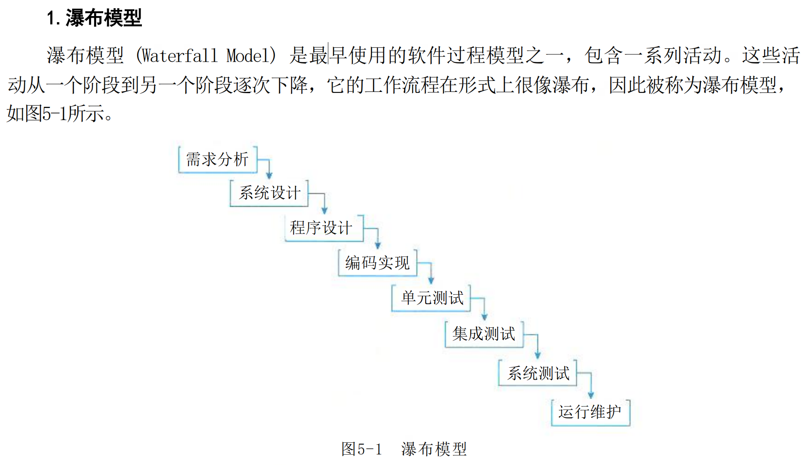
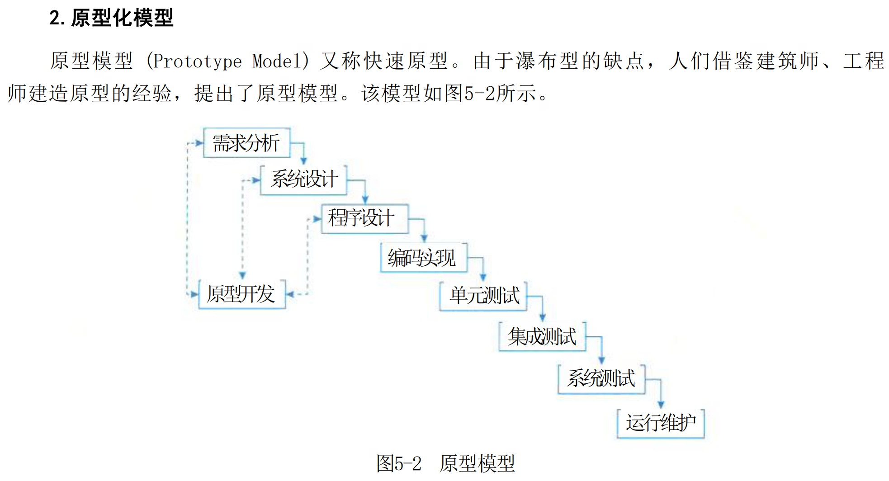
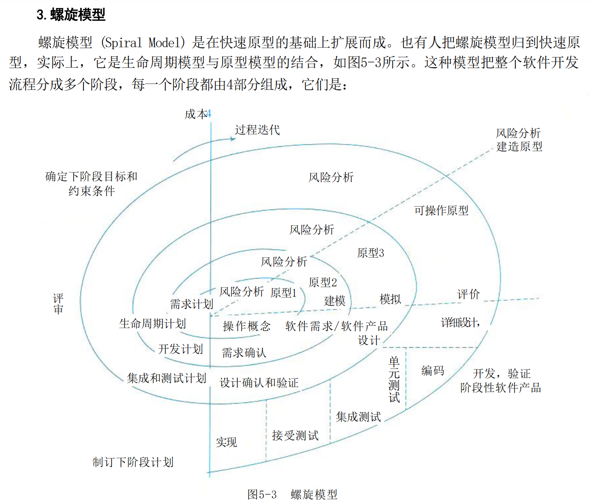
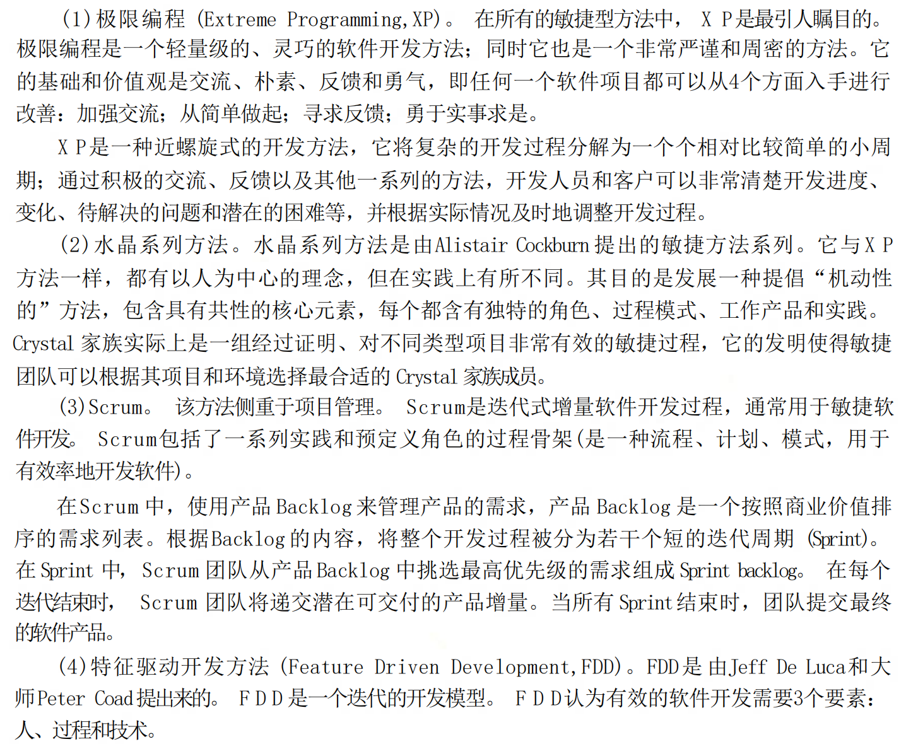
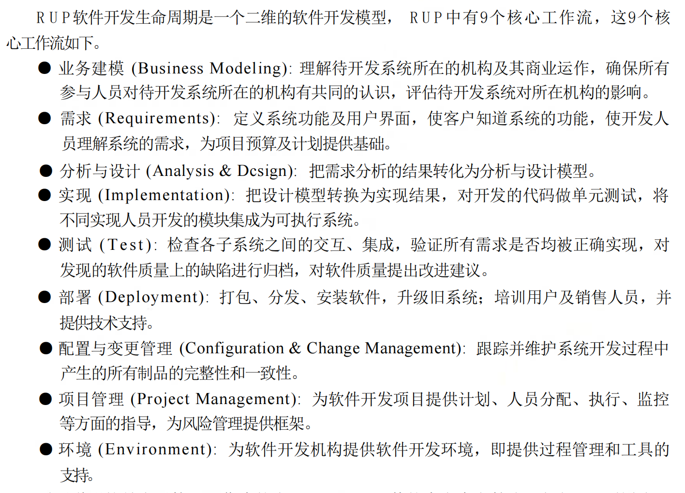
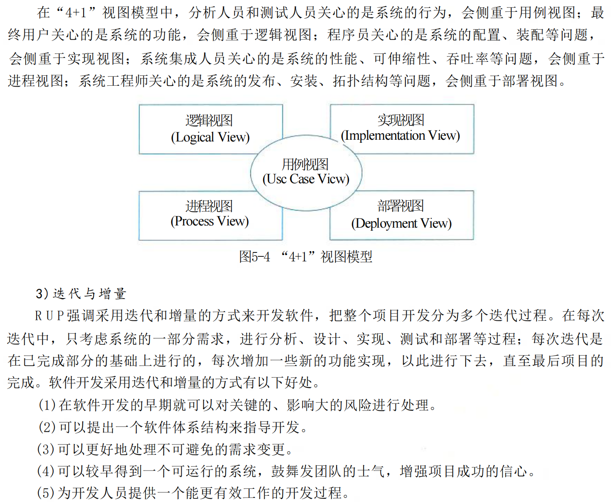

## Toc

### Contents
### 软件过程模型
软件要经历从需求分析、软件设计、软件开发、运行维护，直至被淘汰这样的全过程，这 个全过程称为软件的生命周期。软件生命周期描述了软件从生到死的全过程

敏捷模型
（1）敏捷型方法是“适应性” (adaptive) 而非“预设性” (predictive) 的。重型方法试图对一个
软件开发项目在很长的时间跨度内做出详细的计划，然后依计划进行开发。这类方法在计划制
订完成后拒绝变化，而敏捷型方法欢迎变化。其实，敏捷的目的就是成为适应变化的过程，甚
至能允许改变自身来适应变化。
（2）敏捷型方法是“面向人的” (People-oriented) 而非“面向过程的” (Process-oriented)。 它们
试图使软件开发工作能够充分发挥人的创造能力。它们强调软件开发应当是一项愉快的活动。
（3）迭代增量式的开发过程。敏捷方法以原型开发思想为基础，采用迭代增量式开发，发
行版本小型化。它根据客户需求的优先级和开发风险，制订版本发行计划，每一发行版都是在
前一成功发行版的基础上进行功能需求扩充，最后满足客户的所有功能需求。

#### 统一过程模型 (RUP)
##### 生命周期

##### RUP中的核心概念
RUP 中定义了如下一些核心概念，理解这些概念对于理解RUP很有帮助。
● 角色 (Role):Who的问题。角色描述某个人或一个小组的行为与职责。 RUP预先
定义了很多角色，如体系结构师 (Architect)、 设计人员 (Designer)、 实现人员
(Implementer)、 测试员 (tester) 和配置管理人员 (Configuration Manager) 等，并对
每一个角色的工作和职责都做了详尽的说明。
● 活动 (Activity):How的问题。活动是一个有明确目的的独立工作单元。
● 制 品(Artifact):What的问题。制品是活动生成、创建或修改的一段信息。也有些书把
Artifact翻译为产品、工件等，和制品的意思差不多。
● 工作流 (Workflow):When 的问题。工作流描述了一个有意义的连续的活动序列，每
个工作流产生一些有价值的产品，并显示了角色之间的关系。
RUP 2003对这些
##### RUP 的特点
RUP是用例驱动的、以体系结构为中心的、迭代和增量的软件开发过程。下面对这些特点
做进一步的分析。
1)用例驱动
RUP中的开发活动是用例驱动的，即需求分析、设计、实现和测试等活动都是用例驱
动的。
2)以体系结构为中心
RUP中的开发活动是围绕体系结构展开的。

#### 系统分析与设计