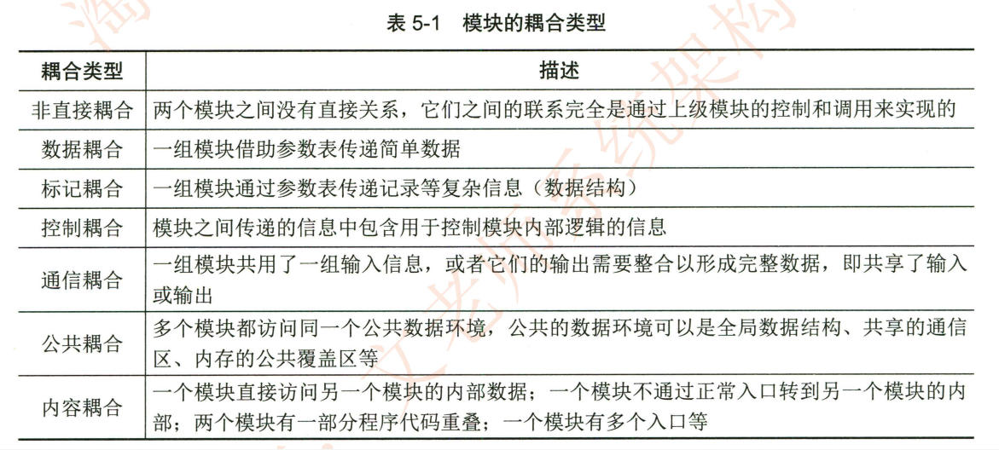
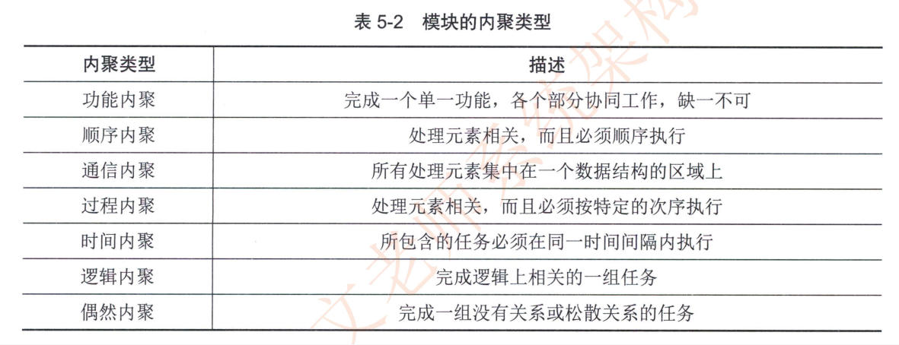

### 软件过程模型
软件要经历从需求分析、软件设计、软件开发、运行维护，直至被淘汰这样的全过程，这 个全过程称为软件的生命周期。软件生命周期描述了软件从生到死的全过程
#### 一、瀑布模型

   1. **原理**
    
    - 瀑布模型是一种线性顺序的软件开发模型，按照软件生命周期的各个阶段依次进行，如同瀑布流水一样，每个阶段都有明确的输入和输出，前一个阶段完成后才进入下一个阶段。这些阶段通常包括需求分析、设计、编码、测试、维护等。
        
2. **优点**
        - **阶段明确，便于管理**：每个阶段都有明确的任务和交付成果，易于项目的计划、组织和管理。例如，在需求分析阶段结束时，会生成详细的需求规格说明书，这为后续的设计、开发等阶段提供了清晰的依据。
        
    - **文档驱动，有利于追溯**：强调文档的完整性和准确性，每个阶段都会产生大量详细的文档，方便在项目开发过程中以及后续维护阶段进行追溯和审查。例如，设计文档可以帮助开发人员理解系统架构，测试文档可以指导测试人员进行测试工作。
        
    - **适合需求明确稳定的项目**：如果项目的需求在开发初期就能够被清晰、准确地定义，并且在整个开发过程中不会发生太大的变化，瀑布模型可以高效地完成项目开发。例如，一些传统的企业内部管理系统，其功能和业务流程相对固定。
        
3. **缺点**
        - **风险后置**：如果在项目后期（如测试或维护阶段）发现前期（如需求分析或设计阶段）的错误，修改成本非常高。因为需要回溯到前面的阶段进行修改，这可能会影响到整个项目的进度、成本和质量。例如，在编码完成后发现需求分析阶段对某个功能的理解有误，可能需要重新修改需求、重新设计部分模块，然后再重新编码和测试。
        
    - **缺乏灵活性**：难以适应需求的变更。由于瀑布模型的线性特点，一旦项目开始进入下一个阶段，就很难再对前面阶段的成果进行修改。在当今快速变化的市场环境下，需求经常会发生变化，这使得瀑布模型在很多项目中的应用受到限制。
        
    - **客户反馈滞后**：客户在项目开发的后期才能看到可运行的软件，在前期很难直观地了解项目的进展和最终效果，不利于及时获取客户反馈并调整项目方向。
        
 #### 二、快速原型模型

  
 

1. **原理**
    
    - 快速构建软件系统的一个可运行的原型，该原型通常只包含了目标系统的部分核心功能和基本架构。通过让用户尽早地接触和使用这个原型，收集用户的反馈，然后根据反馈对原型进行修改和完善，不断迭代，直到满足用户的需求。
        
2. **优点**
        - **快速获取反馈**：用户能够在项目早期就看到软件的大致模样，从而可以及时提供反馈意见。开发人员可以根据这些反馈快速调整开发方向，提高了用户满意度。例如，在开发一个新的手机应用时，通过快速构建一个原型，让用户试用并提出界面布局、操作流程等方面的意见。
        
    - **渐进式开发**：通过不断迭代，逐步增加系统的功能和完善系统的细节。这种渐进式的开发方式使得项目能够更好地适应需求的变化。例如，每次迭代可以根据用户反馈增加新的功能模块或者优化现有功能的性能。
        
    - **降低风险**：由于在早期就进行用户反馈的收集，能够及时发现需求理解上的偏差或者设计上的问题，从而降低了项目后期出现重大风险（如需求变更导致的大规模返工）的可能性。
        
3. **缺点**
        - **文档容易被忽视**：在快速迭代的过程中，开发团队可能更关注原型的修改和功能的完善，而忽视了文档的编写。这可能会导致在项目后期维护或者团队成员更替时，缺乏必要的文档支持。
        
    - **可能导致项目范围蔓延**：如果没有对用户反馈进行有效的管理，用户可能会不断提出新的需求，导致项目的范围不断扩大，超出最初的计划和预算。例如，用户在试用原型的过程中，可能会提出一些与项目目标不太相关但看似有用的功能要求。
        
    - **对开发团队要求较高**：要求开发团队能够快速构建原型并且具有较强的应变能力，能够根据用户反馈及时调整开发思路和技术方案。
        
#### 三、敏捷开发模型

  1. **原理**
    
    - 敏捷开发强调个体和互动、可工作的软件、客户合作和响应变化。它采用迭代和增量的开发方式，将项目分解为多个短周期的迭代，每个迭代都包含从需求分析、设计、开发、测试到交付的完整过程。敏捷开发注重团队成员之间的紧密协作、与客户的持续沟通以及对变化的快速响应。
        
2. **优点**
    
    - **高度的灵活性和适应性**：能够快速响应需求的变化，在每个迭代中都可以根据客户需求或者市场变化对项目进行调整。例如，在一个互联网产品开发项目中，如果竞争对手推出了新的功能，敏捷开发团队可以在接下来的迭代中迅速加入类似的功能。
        
    - **客户参与度高**：客户在整个开发过程中都能密切参与，从需求定义、功能优先级排序到对每个迭代成果的验收。这有助于确保项目开发的方向始终符合客户的期望。例如，客户可以直接参与敏捷团队的每日站会，了解项目进展并及时提出意见。
        
    - **团队协作性强**：强调团队成员之间的沟通、协作和自我组织。通过各种敏捷实践（如每日站会、迭代回顾等），促进团队成员之间的信息共享和问题解决，提高了团队的工作效率和项目的成功率。
        
3. **缺点**
    
    - **文档相对不足**：敏捷开发更注重可工作的软件而不是详尽的文档，这可能会导致在项目后期维护或者新成员加入时，缺乏足够的文档资料来理解项目的全貌。虽然敏捷并不排斥文档，但在实际操作中可能会出现文档编写不充分的情况。
        
    - **对团队成员要求高**：要求团队成员具备多方面的技能、高度的自律性和团队合作精神。由于项目是迭代进行的，团队成员需要不断地调整工作内容和节奏，如果成员能力不足或者缺乏自律性，可能会影响项目的进展。
        
    - **项目进度和质量较难精确评估**：由于敏捷开发的灵活性和需求的不断变化，很难在项目初期就对项目的进度和最终质量进行精确的预测和评估。这可能会给项目管理带来一定的挑战。
        
#### 四、迭代模型
 
 1. **原理**
    
    - 迭代模型与敏捷开发类似，也是采用迭代的方式进行软件开发。它将项目划分为多个迭代周期，每次迭代都会产生一个可运行的版本，这个版本包含了部分功能的实现。随着迭代的进行，软件的功能逐步完善，最终形成完整的产品。
        
2. **优点**
    
    - **逐步明确需求**：允许在项目开发过程中逐步明确需求。在每个迭代中，都可以根据前一个迭代的结果对需求进行调整和完善。这对于那些在项目初期需求不太明确，但有一定的大致方向的项目非常有用。例如，在一个新兴领域的软件项目开发中，随着项目的推进，开发团队对业务的理解不断加深，从而可以更好地调整需求。
        
    - **降低风险**：通过多次迭代，在早期就可以发现和解决项目中的风险（如技术难题、需求理解偏差等）。如果在某个迭代中发现了技术上不可行的问题，可以及时调整技术方案，避免在项目后期才发现问题而导致大规模返工。
        
    - **易于管理和控制**：每个迭代都有明确的目标、计划和交付成果，便于项目的管理和控制。项目经理可以根据每个迭代的情况来评估项目的进度、质量和资源使用情况。
        
3. **缺点**
    
    - **项目周期可能较长**：由于需要进行多次迭代，如果每次迭代的周期控制不好或者迭代次数过多，可能会导致项目的总周期较长。这可能会增加项目的成本，并且在市场竞争激烈的情况下，可能会使产品失去市场先机。
        
    - **需要良好的规划**：对迭代的规划要求较高，如果在迭代规划阶段没有准确地定义每个迭代的功能范围、目标和资源需求，可能会导致迭代过程中出现混乱，影响项目的顺利进行。例如，如果某个迭代的功能范围过大，可能会导致该迭代无法按时完成。
        
增加螺旋模型，且每个模型附上英文名称

以下是包含螺旋模型（Spiral Model）在内的常见软件过程模型及其优缺点：

  #### 一、瀑布模型（Waterfall Model）
1. **原理**
    
    - 瀑布模型是一种线性顺序的软件开发模型，按照软件生命周期的各个阶段依次进行，如同瀑布流水一样，每个阶段都有明确的输入和输出，前一个阶段完成后才进入下一个阶段。这些阶段通常包括需求分析（Requirement Analysis）、设计（Design）、编码（Coding）、测试（Testing）、维护（Maintenance）等。
        
2. **优点**
    
    - **阶段明确，便于管理**：每个阶段都有明确的任务和交付成果，易于项目的计划、组织和管理。例如，在需求分析阶段结束时，会生成详细的需求规格说明书，这为后续的设计、开发等阶段提供了清晰的依据。
        
    - **文档驱动，有利于追溯**：强调文档的完整性和准确性，每个阶段都会产生大量详细的文档，方便在项目开发过程中以及后续维护阶段进行追溯和审查。例如，设计文档可以帮助开发人员理解系统架构，测试文档可以指导测试人员进行测试工作。
        
    - **适合需求明确稳定的项目**：如果项目的需求在开发初期就能够被清晰、准确地定义，并且在整个开发过程中不会发生太大的变化，瀑布模型可以高效地完成项目开发。例如，一些传统的企业内部管理系统，其功能和业务流程相对固定。
        
3. **缺点**
    
    - **风险后置**：如果在项目后期（如测试或维护阶段）发现前期（如需求分析或设计阶段）的错误，修改成本非常高。因为需要回溯到前面的阶段进行修改，这可能会影响到整个项目的进度、成本和质量。例如，在编码完成后发现需求分析阶段对某个功能的理解有误，可能需要重新修改需求、重新设计部分模块，然后再重新编码和测试。
        
    - **缺乏灵活性**：难以适应需求的变更。由于瀑布模型的线性特点，一旦项目开始进入下一个阶段，就很难再对前面阶段的成果进行修改。在当今快速变化的市场环境下，需求经常会发生变化，这使得瀑布模型在很多项目中的应用受到限制。
        
    - **客户反馈滞后**：客户在项目开发的后期才能看到可运行的软件，在前期很难直观地了解项目的进展和最终效果，不利于及时获取客户反馈并调整项目方向。
        

#### 二、快速原型模型（Rapid Prototype Model）
 
1. **原理**
    
    - 快速构建软件系统的一个可运行的原型，该原型通常只包含了目标系统的部分核心功能和基本架构。通过让用户尽早地接触和使用这个原型，收集用户的反馈，然后根据反馈对原型进行修改和完善，不断迭代，直到满足用户的需求。
        
2. **优点**
    
    - **快速获取反馈**：用户能够在项目早期就看到软件的大致模样，从而可以及时提供反馈意见。开发人员可以根据这些反馈快速调整开发方向，提高了用户满意度。例如，在开发一个新的手机应用时，通过快速构建一个原型，让用户试用并提出界面布局、操作流程等方面的意见。
        
    - **渐进式开发**：通过不断迭代，逐步增加系统的功能和完善系统的细节。这种渐进式的开发方式使得项目能够更好地适应需求的变化。例如，每次迭代可以根据用户反馈增加新的功能模块或者优化现有功能的性能。
        
    - **降低风险**：由于在早期就进行用户反馈的收集，能够及时发现需求理解上的偏差或者设计上的问题，从而降低了项目后期出现重大风险（如需求变更导致的大规模返工）的可能性。
        
3. **缺点**
    
    - **文档容易被忽视**：在快速迭代的过程中，开发团队可能更关注原型的修改和功能的完善，而忽视了文档的编写。这可能会导致在项目后期维护或者团队成员更替时，缺乏必要的文档支持。
        
    - **可能导致项目范围蔓延**：如果没有对用户反馈进行有效的管理，用户可能会不断提出新的需求，导致项目的范围不断扩大，超出最初的计划和预算。例如，用户在试用原型的过程中，可能会提出一些与项目目标不太相关但看似有用的功能要求。
        
    - **对开发团队要求较高**：要求开发团队能够快速构建原型并且具有较强的应变能力，能够根据用户反馈及时调整开发思路和技术方案。
        

  #### 三、敏捷开发模型（Agile Development Model）

  1. **原理**
    
    - 敏捷开发强调个体和互动（Individuals and Interactions）、可工作的软件（Working Software）、客户合作（Customer Collaboration）和响应变化（Responding to Change）。它采用迭代（Iteration）和增量（Increment）的开发方式，将项目分解为多个短周期的迭代，每个迭代都包含从需求分析、设计、开发、测试到交付的完整过程。敏捷开发注重团队成员之间的紧密协作、与客户的持续沟通以及对变化的快速响应。
        
2. **优点**
    
    - **高度的灵活性和适应性**：能够快速响应需求的变化，在每个迭代中都可以根据客户需求或者市场变化对项目进行调整。例如，在一个互联网产品开发项目中，如果竞争对手推出了新的功能，敏捷开发团队可以在接下来的迭代中迅速加入类似的功能。
        
    - **客户参与度高**：客户在整个开发过程中都能密切参与，从需求定义、功能优先级排序到对每个迭代成果的验收。这有助于确保项目开发的方向始终符合客户的期望。例如，客户可以直接参与敏捷团队的每日站会（Daily Stand - up Meeting），了解项目进展并及时提出意见。
        
    - **团队协作性强**：强调团队成员之间的沟通、协作和自我组织。通过各种敏捷实践（如每日站会、迭代回顾（Iteration Review）等），促进团队成员之间的信息共享和问题解决，提高了团队的工作效率和项目的成功率。
        
3. **缺点**
    
    - **文档相对不足**：敏捷开发更注重可工作的软件而不是详尽的文档，这可能会导致在项目后期维护或者新成员加入时，缺乏足够的文档资料来理解项目的全貌。虽然敏捷并不排斥文档，但在实际操作中可能会出现文档编写不充分的情况。
        
    - **对团队成员要求高**：要求团队成员具备多方面的技能、高度的自律性和团队合作精神。由于项目是迭代进行的，团队成员需要不断地调整工作内容和节奏，如果成员能力不足或者缺乏自律性，可能会影响项目的进展。
        
    - **项目进度和质量较难精确评估**：由于敏捷开发的灵活性和需求的不断变化，很难在项目初期就对项目的进度和最终质量进行精确的预测和评估。这可能会给项目管理带来一定的挑战。
        
  #### 四、迭代模型（Iterative Model）
 
 1. **原理**
    
    - 迭代模型与敏捷开发类似，也是采用迭代的方式进行软件开发。它将项目划分为多个迭代周期，每次迭代都会产生一个可运行的版本，这个版本包含了部分功能的实现。随着迭代的进行，软件的功能逐步完善，最终形成完整的产品。
        
2. **优点**
    
    - **逐步明确需求**：允许在项目开发过程中逐步明确需求。在每个迭代中，都可以根据前一个迭代的结果对需求进行调整和完善。这对于那些在项目初期需求不太明确，但有一定的大致方向的项目非常有用。例如，在一个新兴领域的软件项目开发中，随着项目的推进，开发团队对业务的理解不断加深，从而可以更好地调整需求。
        
    - **降低风险**：通过多次迭代，在早期就可以发现和解决项目中的风险（如技术难题、需求理解偏差等）。如果在某个迭代中发现了技术上不可行的问题，可以及时调整技术方案，避免在项目后期才发现问题而导致大规模返工。
        
    - **易于管理和控制**：每个迭代都有明确的目标、计划和交付成果，便于项目的管理和控制。项目经理可以根据每个迭代的情况来评估项目的进度、质量和资源使用情况。
        
3. **缺点**
    
    - **项目周期可能较长**：由于需要进行多次迭代，如果每次迭代的周期控制不好或者迭代次数过多，可能会导致项目的总周期较长。这可能会增加项目的成本，并且在市场竞争激烈的情况下，可能会使产品失去市场先机。
        
    - **需要良好的规划**：对迭代的规划要求较高，如果在迭代规划阶段没有准确地定义每个迭代的功能范围、目标和资源需求，可能会导致迭代过程中出现混乱，影响项目的顺利进行。例如，如果某个迭代的功能范围过大，可能会导致该迭代无法按时完成。
        
#### 五、螺旋模型（Spiral Model）

  1. **原理**
    
    - 螺旋模型将软件开发过程视为一个螺旋式的迭代过程，每个迭代周期都包含制定计划（Planning）、风险分析（Risk Analysis）、实施工程（Engineering）和客户评估（Customer Evaluation）四个阶段。项目沿着螺旋路径逐步进行，每一圈螺旋代表一个迭代，迭代的半径逐步增大，代表项目的规模和复杂度逐渐增加。它结合了瀑布模型的系统性和顺序性以及快速原型模型的迭代特征。
        
2. **优点**
    
    - **风险驱动**：将风险分析融入到软件开发的每个迭代过程中。在每个迭代的早期就进行风险识别、评估和应对措施的制定，有助于降低项目的总体风险。例如，在开发一个大型复杂的航空航天软件项目时，可以及时识别出技术风险（如新算法的可行性）、需求风险（如需求变更的可能性）等，并采取相应的措施。
        
    - **逐步深化的开发过程**：随着迭代的进行，软件项目的规模和复杂度逐步增加，同时每个迭代都建立在前一个迭代的基础上，使得开发过程逐步深化。这种逐步深化的方式有利于开发团队更好地理解项目需求和技术难点，提高项目的成功率。
        
    - **适合大型复杂项目**：对于大型、高风险、需求不太明确的项目具有较好的适应性。例如，大型企业级的信息系统集成项目，涉及多个子系统的集成和复杂的业务流程，螺旋模型可以在项目的不同阶段根据实际情况调整开发策略。
        
3. **缺点**
    
    - **过程复杂**：由于螺旋模型的迭代过程包含多个阶段，且每个迭代都要进行风险分析等复杂操作，使得项目的管理和开发过程相对复杂。需要有经验的项目团队和良好的项目管理能力才能有效地实施。
        
    - **成本较高**：因为每个迭代都要进行详细的风险分析和规划，这会增加项目的开发成本，包括人力成本、时间成本等。而且，对于小型项目来说，采用螺旋模型可能会导致过度分析，增加不必要的成本。
        
    - **对项目团队要求高**：要求项目团队成员具备多方面的知识和技能，包括风险分析、项目管理、软件开发技术等。同时，团队成员之间需要密切协作，以确保每个迭代阶段的顺利进行。

敏捷模型
（1）敏捷型方法是“适应性” (adaptive) 而非“预设性” (predictive) 的。重型方法试图对一个
软件开发项目在很长的时间跨度内做出详细的计划，然后依计划进行开发。这类方法在计划制
订完成后拒绝变化，而敏捷型方法欢迎变化。其实，敏捷的目的就是成为适应变化的过程，甚
至能允许改变自身来适应变化。
（2）敏捷型方法是“面向人的” (People-oriented) 而非“面向过程的” (Process-oriented)。 它们
试图使软件开发工作能够充分发挥人的创造能力。它们强调软件开发应当是一项愉快的活动。
（3）迭代增量式的开发过程。敏捷方法以原型开发思想为基础，采用迭代增量式开发，发
行版本小型化。它根据客户需求的优先级和开发风险，制订版本发行计划，每一发行版都是在
前一成功发行版的基础上进行功能需求扩充，最后满足客户的所有功能需求。

### 统一过程模型 (RUP)
#### 生命周期

#### RUP中的核心概念
RUP 中定义了如下一些核心概念，理解这些概念对于理解RUP很有帮助。
● 角色 (Role):Who的问题。角色描述某个人或一个小组的行为与职责。 RUP预先
定义了很多角色，如体系结构师 (Architect)、 设计人员 (Designer)、 实现人员
(Implementer)、 测试员 (tester) 和配置管理人员 (Configuration Manager) 等，并对
每一个角色的工作和职责都做了详尽的说明。
● 活动 (Activity):How的问题。活动是一个有明确目的的独立工作单元。
● 制 品(Artifact):What的问题。制品是活动生成、创建或修改的一段信息。也有些书把
Artifact翻译为产品、工件等，和制品的意思差不多。
● 工作流 (Workflow):When 的问题。工作流描述了一个有意义的连续的活动序列，每
个工作流产生一些有价值的产品，并显示了角色之间的关系。
RUP 2003对这些
#### RUP的特点

RUP是用例驱动的、以体系结构为中心的、迭代和增量的软件开发过程。

#### 1 用例驱动

#### 2 以体系结构为中心

体系结构的设计需要考虑多方面的问题：在功能性特征方面要考虑系统的功能；在非功能性特征方面要考虑系统的性能、安全性和可用性等；与软件开发有关的特征要考虑可修改性、可移植性、可重用性、可集成性和可测试性等；与开发经济学有关的特征要考虑开发时间、费用、系统的生命期等。当然，这些特征之间有些是相互冲突的，一个系统不可能在所有的特征上都达到最优，这时就需要系统体系结构设计师在各种可能的选择之间进行权衡。

在“4+1”视图模型中，

- 分析人员和测试人员关心的是系统的行为，会侧重于用例视图；
- 最终用户关心的是系统的功能，会侧重于逻辑视图；
- 程序员关心的是系统的配置、装配等问题，会侧重于实现视图；
- 系统集成人员关心的是系统的性能、可伸缩性、吞吐率等问题，会侧重于进程视图；
- 系统工程师关心的是系统的发布、安装、拓扑结构等问题，会侧重于部署视图。

#### 3 迭代与增量

RUP强调采用迭代和增量的方式来开发软件，把整个项目开发分为多个迭代过程。在每次迭代中，只考虑系统的一部分需求，进行分析、设计、实现、测试和部署等过程；每次迭代是在已完成部分的基础上进行的，每次增加一些新的功能实现，以此进行下去，直至最后项目的完成。

### 能力成熟度模型CMM

- 初始级（Initial）
- 可重复级（Repeatable）
- 已定义级（Defined）
- 已管理级（Managed）
- 已优化级（optimized）

### 软件需求
#### 概念

是指用户对系统在功能、行为、性能、设计约束等方面的期望。

#### 软件需求类别

- 业务需求
- 用户需求
- 系统需求
    - 功能需求：也称行为需求，规定了开发人员必须在系统中实现的软件功能
    - 非功能需求：指系统必须具备的属性或者品质
        - 软件质量属性：可维护性、可靠性、效率
        - 其他非功能性需求
    - 设计约束：例如只能使用linux系统或者信创产品

#### 需求获取

是一个确定和理解不同的项目干系人的需求和约束的过程。

方法：

- 用户访谈
- 问卷调查
- 采样
- 情节串联板：用图讲故事
- 联合需求计划（JRP）
- 需求记录技术：如任务卡片

#### 需求分析

UML（Unified Modeling Language，统一建模语言）中的用例图（Use Case Diagram）

#### 序列图有哪三种消息和概念

- 同步消息
- 异步消息
- 返回消息

#### 序列图表示条件分支序列片段包括

- Alt
- Opt
- Loop
- Break
- Par

### 系统分析与设计
#### 结构化分析方法

是一组帮助系统分析人员产生功能规约的原理和技术。他一般利用图形表达用户需求，使用的手主要有数据流图、数据字典、结构化语言、判定表以及判定树等

#### 步骤：

- 分析业务情况，做出反映当前物理模型的数据流图DFD
- 推导出等价的逻辑模型的DFD
- 设计新的逻辑系统，生成数据字典和基元描述
- 建立人机接口，提出可供选择的目标系统物理模型的DFD
- 确定各种方案的成本和风险等级
- 选择一种方案
- 建立完整的需求规约

#### 结构化设计

    结构化设计 (Structured Design, SD) 是一种面向数据流的设计方法，它以SRS和 SA阶段所产生的数据流图和数据字典等文档为基础，是一个自顶向下、逐步求精和模块化的过程。 SD方法的基本思想是将软件设计成由相对独立且具有单一功能的模块组成的结构，分为概要设计和详细设计两个阶段，其中概要设计的主要任务是确定软件系统的结构，对系统进行模块划分，确定每个模块的功能、接口和模块之间的调用关系；详细设计的主要任务是为每个模块设计实现的细节。

#### 耦合

#### 内聚

### 基于构件的软件工程
基于构件的软件工程 (Component-Based Software Engineering,CBSE) 是一种基于分布对象技术、强调通过可复用构件设计与构造软件系统的软件复用途径。基于构件的软件系统中的 构件可以是 COTS(Commercial-Off-The-Shelf) 构件，也可以是通过其他途径获得的构件(如 自行开发)。 C B S E 体现了“购买而不是重新构造”的哲学，将软件开发的重点从程序编写转移 到了基于已有构件的组装，以更快地构造系统，减轻用来支持和升级大型系统所需要的维护负担，从而降低软件开发的费用。

#### 构件

用于 CBSE 的构件应该具备以下特征：

- 可组装型
- 可部署性
- 文档化
- 独立性
- 标准化

#### 构件模型

构件模型包含了一些模型要素，这些要素信息定义了构件接口、在程序中使用构件需要知 道的信息，以及构件应该如何部署：

- 接口
- 使用信息
- 部署

#### CBSE过程

CBSE 过程是支持基于构件组装的软件开发过程，需要考虑构件复用的可能性，以及在开发和使用可复用的构件中所涉及的不同过程活动。成功的构件复用需要一个经过裁剪、适配的开发过程，以便在软件开发过程中包含可复用的构件。

CBSE过程中的主要活动包括 ：

- 系统需求概览
- 识别候选构件
- 根据发现的构件修改需求
- 体系结构设计 
- 构件定制与适配 
- 组装构件，创建系统 

#### 构件组装

构件组装是指构件相互直接集成或是用专门编写的“胶水代码”将它们整合在一起来创造 一个系统或另一个构件的过程。  
常见的组装构件有以下3种组装方式。

- 顺序组装
- 层次组装
- 叠加组装

### 软件工程各阶段方法及相关工具及过程方法总结
#### 需求获取/分析

用户面谈

需求专题讨论会

问卷调查

现场观察

原型化方法

头脑风暴

#### 系统分析（衔接过程）

结构化分析：

数据流图（DFD）

数据字段

#### 系统设计

系统结构图（概要设计）

NS图

PAD图

PDL

ER图（概念设计、数据库设计）

全阶段：

UML

#### 软件测试

单元测试

集成测试

系统测试

性能测试

验收测试

其他测试

### 概念与区分
#### ER图是属于需求分析阶段还是系统设计阶段
ER 图（实体 - 关系图）主要属于系统设计阶段，但在需求分析与系统设计阶段之间存在一定的关联和过渡作用。

1. **与需求分析阶段的联系**
    - 在需求分析阶段，重点是确定系统的功能需求、用户需求和业务流程等。虽然 ER 图不是需求分析阶段的核心成果，但在需求分析过程中可能会初步涉及到对数据的描述和分析。例如，通过与用户沟通，了解业务中涉及哪些实体（如在一个电商系统中，有用户、商品、订单等实体）以及这些实体之间可能存在的关系（用户与订单是一对多关系，商品与订单是多对多关系等），这些初步的关于数据的信息可以为后续绘制 ER 图奠定基础。
2. **在系统设计阶段的核心地位**
    - **概念结构设计**
        - ER 图在系统设计阶段的数据库设计部分起到关键的概念结构设计作用。它以图形化的方式清晰地表示出系统中的实体（例如在图书馆管理系统中的读者、图书、借阅记录等实体）、实体的属性（如读者的姓名、年龄、借书证号等，图书的书名、作者、ISBN 号等）以及实体之间的关系（如读者与借阅记录是一对多关系，图书与借阅记录也是一对多关系）。这种直观的表示有助于数据库设计人员全面、准确地把握系统的数据结构。
    - **向逻辑结构转换的基础**
        - ER 图是将概念结构转换为数据库逻辑结构（如关系模型）的重要依据。在系统设计中，基于 ER 图可以将实体转换为关系表，实体的属性转换为表中的列，实体间的关系通过外键等方式在表结构中体现。例如，将上述图书馆管理系统中的读者实体转换为 “读者表”，图书实体转换为 “图书表”，借阅记录实体转换为 “借阅记录表”，并且在 “借阅记录表” 中设置读者 ID 和图书 ID 作为外键来表示与 “读者表” 和 “图书表” 的关系。
    - **数据完整性和一致性设计的参考**
        - 在设计数据库的完整性约束（如实体完整性、参照完整性等）时，ER 图提供了重要的参考。例如，从 ER 图中的实体关系可以确定外键约束的设置，以确保数据的一致性。如果在 ER 图中表示了订单与用户之间的关系，那么在数据库设计时就可以通过外键约束来保证订单中的用户 ID 必须是用户表中存在的有效 ID，从而维护数据的完整性。

#### 软件工程需求分析阶段有哪些工具
在软件工程的需求分析阶段，有以下一些常用工具：
 ##### 一、用于需求获取的工具
1. **访谈**
    - **概述**：这是最基本的需求获取工具，通过与客户、用户、利益相关者等进行面对面的交流来收集需求。可以是一对一的访谈，也可以是小组访谈。
    - **优势**：能够直接获取用户的第一手需求，深入了解他们的工作流程、期望和痛点。可以及时追问和澄清问题，确保对需求的理解准确。例如，在开发企业资源管理系统时，通过与各个部门的管理人员访谈，了解他们在资源分配、人员管理等方面的具体需求。
    - **局限性**：比较耗时，尤其是当涉及大量用户时效率较低。而且可能受到被访谈者主观因素的影响，如表达能力、对项目的理解程度等。
2. **问卷调查**
    - **概述**：设计一系列有针对性的问题，分发给大量的用户或利益相关者，以收集广泛的需求信息。
    - **优势**：可以覆盖较大范围的人群，获取不同视角的需求。成本相对较低，适合大规模的数据收集。例如，在开发一款大众消费类的手机应用时，可以通过网络问卷的形式向广大潜在用户收集关于功能、界面风格、使用习惯等方面的需求。
    - **局限性**：问题的设计需要精心考虑，否则可能得到不准确或不完整的答案。难以深入探究复杂问题，对开放性问题的回答分析可能比较困难。
3. **观察法**
    - **概述**：到用户的实际工作或使用环境中观察他们的操作行为、工作流程等，从而发现隐藏的需求。
    - **优势**：能够发现用户实际做什么，而不仅仅是他们所说的需求。可以获取到一些难以通过访谈或问卷发现的需求，如用户的习惯性操作、工作中的实际协作方式等。例如，在设计医院挂号系统时，到医院挂号窗口观察工作人员和患者的交互过程，能发现一些流程优化的需求。
    - **局限性**：可能会影响被观察者的正常行为，导致观察结果存在偏差。而且对于一些涉及内部心理活动或决策过程的需求难以准确观察。
##### 二、用于需求整理与分析的工具
1. **亲和图（KJ 法）**
    - **概述**：将大量收集到的需求信息（如观点、想法、问题等）进行分类整理。通常是把这些信息写在卡片上，然后根据它们的相似性进行分组、归类，形成不同的类别和层次结构。
    - **优势**：有助于从杂乱无章的需求中发现规律和模式，促进团队成员对需求的共同理解。可以发现不同需求之间的潜在联系，为后续的需求分析和系统设计提供思路。例如，在一个新产品研发项目中，通过亲和图将用户对产品功能、外观、易用性等方面的众多需求进行分类，以便更好地确定产品的特性。
    - **局限性**：对信息的分类和整理可能存在一定的主观性，不同的人可能会得出不同的分类结果。
2. **鱼骨图（因果图）**
    - **概述**：用于分析需求产生的原因或影响需求的因素。它以问题（需求）为鱼头，将可能导致该问题的因素分为几个大类（如人、机、料、法、环等方面）作为鱼骨，然后逐步细化每个大类下的具体原因作为鱼刺。
    - **优势**：能够系统地分析需求的成因，有助于深入理解需求的本质。在需求变更管理中，可以通过鱼骨图分析需求变更的原因，从而采取相应的应对措施。例如，在一个软件项目中，如果存在性能需求不满足的问题，可以通过鱼骨图分析是由于硬件设备、算法效率、网络环境等哪些因素导致的。
    - **局限性**：对于复杂的需求问题，鱼骨图可能会变得过于庞大和复杂，难以全面准确地涵盖所有因素。
3. **需求优先级矩阵**
    - **概述**：通过建立矩阵来评估和确定需求的优先级。矩阵的行可以是不同的需求，列可以是评估优先级的标准（如业务价值、实现难度、对用户的影响等）。根据每个需求在不同标准下的得分情况，综合确定其优先级。
    - **优势**：提供了一种科学、客观的方法来确定需求的优先级，有助于合理安排项目资源和开发进度。例如，在一个多模块的软件项目中，可以使用需求优先级矩阵确定哪些模块的需求应该先开发，哪些可以稍后开发。
    - **局限性**：评估标准的确定可能存在主观性，而且不同需求在不同标准下的得分量化可能比较困难。

  
 

##### 三、用于需求文档化的工具

  
 

1. **自然语言处理工具（如 Microsoft Word）**
    - **概述**：使用自然语言编写需求规格说明书等文档。可以详细地描述需求的各个方面，包括功能需求、非功能需求、用户界面需求等。
    - **优势**：易于理解和编写，不需要特殊的技术知识。可以灵活地表达各种复杂的需求情况。例如，在描述一个办公自动化软件的需求时，可以详细地用文字说明文档编辑、格式设置、文件管理等功能的要求。
    - **局限性**：自然语言可能存在歧义性，不同的人对同一段文字的理解可能不同。文档的结构可能不够清晰和规范，难以进行自动化的分析和处理。
2. **需求管理工具（如 JIRA、IBM Rational RequisitePro）**
    - **概述**：专门用于需求的管理，包括需求的创建、存储、跟踪、变更管理等功能。可以将需求以结构化的方式进行组织，设置需求的属性（如优先级、状态、负责人等）。
    - **优势**：提高了需求管理的效率和准确性。便于团队成员之间的协作，不同人员可以清楚地了解需求的状态和进展。例如，开发人员可以通过需求管理工具查看哪些需求正在开发，测试人员可以查看哪些需求已经准备好进行测试。
    - **局限性**：需要一定的学习成本来掌握工具的使用。而且工具的功能可能受到其自身设计的限制，对于一些特殊的需求管理情况可能无法很好地满足。
3. **UML（统一建模语言）中的用例图**
    - **概述**：用例图是 UML 中的一种，用于描述系统与外部参与者（用户、其他系统等）之间的交互关系，展示系统的功能范围。它通过用例（系统提供的功能）、参与者（与系统交互的对象）和它们之间的关系（如关联、包含、扩展等）来表示需求。
    - **优势**：以图形化的方式直观地展示系统的功能需求，便于不同人员（包括非技术人员）理解。可以清晰地表示出不同参与者与系统功能之间的关系，有助于发现功能需求中的遗漏或重复。例如，在设计一个网上银行系统时，用例图可以展示出客户、银行柜员、系统管理员等参与者与存款、取款、转账等用例之间的关系。
    - **局限性**：主要侧重于功能需求的描述，对于非功能需求（如性能、可靠性等）的表达不够直接。而且对于复杂系统，用例图可能会变得非常复杂，难以阅读和理解。

####  软件工程系统设计阶段有哪些工具

在软件工程的系统设计阶段，有以下一些常用的工具：

##### 一、用于架构设计的工具

1. **UML（统一建模语言）**
    - **类图**
        - **概述**：类图用于描述系统中的类、类的属性、操作以及类与类之间的关系（如继承、关联、聚合、组合等）。它是面向对象设计中非常重要的工具，可以直观地展示系统的静态结构。
        - **应用示例**：在设计一个企业员工管理系统时，通过类图可以定义 “员工” 类（包含姓名、年龄、职位等属性和打卡、请假等操作）、“部门” 类（包含部门名称、部门经理等属性）以及它们之间的关联关系（一个部门包含多个员工，一个员工属于一个部门）。
    - **组件图**
        - **概述**：组件图用来表示系统的组件以及组件之间的依赖关系。组件可以是可独立部署的软件单元，如库、模块等。
        - **应用示例**：在一个大型电子商务系统中，组件图可以展示订单处理组件、库存管理组件、支付组件等之间的依赖关系，帮助开发人员理解系统的架构层次和模块间的交互。
    - **部署图**
        - **概述**：部署图描述系统的硬件部署结构，包括硬件设备（如服务器、客户端设备等）以及软件组件在这些硬件设备上的部署情况。
        - **应用示例**：对于一个基于云计算的在线教育系统，部署图可以显示 Web 服务器、数据库服务器、流媒体服务器等硬件设备的分布，以及教学管理软件、视频播放软件等组件在这些设备上的部署位置。
2. **架构描述语言（ADL）**
    - **概述**：ADL 是一种专门用于描述软件架构的形式化语言。它能够精确地定义系统的架构元素、架构风格以及架构规则等。
    - **优势**：可以进行架构的形式化分析，如检查架构的一致性、完整性等。有助于在大型复杂系统的架构设计中确保架构的质量。
    - **应用示例**：在航空航天等对软件可靠性要求极高的领域，使用 ADL 来描述飞行控制系统的架构，明确各个子系统的接口、交互协议等。

  
 

##### **二、用于数据库设计的工具**

  
 

1. **ER 图（实体 - 关系图）**
    - **概述**：ER 图以图形化的方式表示实体（如学生、课程等）、实体的属性（如学生的学号、姓名等）以及实体之间的关系（如学生与课程之间的选课关系）。它是数据库概念设计的重要工具。
    - **应用示例**：在学校管理系统的数据库设计中，通过 ER 图可以清晰地呈现出 “教师”“学生”“课程” 等实体及其相互关系，为后续将概念模型转换为关系模型（如数据库表结构）奠定基础。
2. **数据库建模工具（如 PowerDesigner、ERwin 等）**
    - **概述**：这些工具提供了可视化的界面，用于创建和管理数据库模型。它们不仅可以绘制 ER 图，还可以根据模型自动生成数据库脚本（如 SQL 脚本），用于创建数据库表、索引、约束等。
    - **优势**：提高了数据库设计的效率和准确性。可以方便地进行数据库结构的修改和优化，并且能够生成不同数据库管理系统（如 MySQL、Oracle 等）适用的脚本。
    - **应用示例**：使用 PowerDesigner 设计一个企业资源计划（ERP）系统的数据库模型，从概念模型开始，逐步细化到物理模型，最后生成创建数据库所需的 SQL 语句。

  
 

##### 三、用于界面设计的工具

  
 

1. **原型设计工具（如 Axure、Sketch、Adobe XD 等）**
    - **概述**：这些工具允许设计师快速创建软件系统的界面原型。可以定义界面元素（如按钮、文本框、菜单等）的布局、交互行为（如点击按钮后的跳转、菜单的展开与收起等）以及视觉效果（如颜色、字体等）。
    - **优势**：方便与用户、开发人员等进行沟通，能够在早期获取对界面设计的反馈，及时调整设计方案。可以模拟用户与系统的交互过程，提高用户体验设计的质量。
    - **应用示例**：在移动应用开发项目中，使用 Axure 制作高保真的界面原型，展示给潜在用户和团队成员，以确定界面的布局、操作流程等是否符合用户需求和项目目标。
2. **UI 设计工具（如 Adobe Photoshop、Illustrator 等）**
    - **概述**：主要用于创建界面的视觉元素，如绘制图标、设计界面的艺术风格等。这些工具提供了丰富的图形编辑和设计功能。
    - **优势**：可以制作出高质量、美观的界面视觉效果。适合专业的 UI 设计师进行精细化的界面元素设计。
    - **应用示例**：使用 Adobe Photoshop 设计一个电商网站的首页界面，包括商品图片的处理、促销广告的排版、整体色彩搭配等。