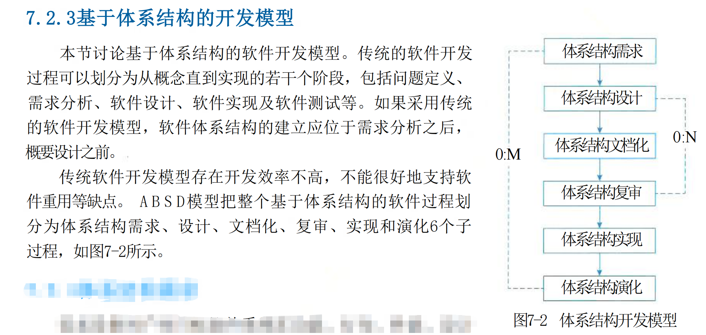

## 软件架构设计与生命周期
有如下生命周期：
（1）需求分析阶段
（2）设计阶段
（3）实现阶段
（4）构件组装阶段
（5）部署阶段
（6）后开发阶段

#### 基于架构的软件开发方法（体系结构的软件设计 Architecture-Based Software Design,ABSD）

## 软件架构风格
软件体系结构设计的一个核心目标是重复的体系结构模式，即达到体系结构级的软件重用。

### 概述

软件体系结构风格是描述某一特定应用领域中系统组织方式的惯用模式。体系结构风格定义一个系统家族，即一个体系结构定义一个词汇表和一组约束。词汇表中包含一些构件和连接件类型，而这组约束指出系统是如何将这些构件和连接件组合起来的。体系结构风格反映了领域中众多系统所共有的结构和语义特性，并指导如何将各个模块和子系统有效地组织成一个完整的系统。对软件体系结构风格的研究和实践促进对设计的重用，一些经过实践证实的解决方案也可以可靠地用于解决新的问题。例如，如果某人把系统描述为“客户/服务器”模式，则不必给出设计细节，人们立刻就会明白系统是如何组织和工作的。

### 数据流体系架构风格

数据流体系结构是一种计算机体系结构，直接与传统的冯·诺依曼体系结构或控制流体系数据流体系结构没有概念上的程序计数器：指令的可执行性和执行仅基于指令输入参数的可用性来确定，因此，指令执行的顺序是不可预测的，即行为是不确定的。数据流体系结构风格主要包括批处理风格和管道-过滤器风格。

#### 批处理体系架构风格

在批处理风格(见图7-7)的软件体系结构中，每个处理步骤是一个单独的程序，每一步必须在前一步结束后才能开始，并且数据必须是完整的，以整体的方式传递。它的基本构件是独立的应用程序，连接件是某种类型的媒介。连接件定义了相应的数据流图，表达拓扑结构。

#### 管道-过滤器体系架构风格

当数据源源不断地产生，系统就需要对这些数据进行若干处理(分析、计算、转换等)。现有的解决方案是把系统分解为几个序贯的处理步骤，这些步骤之间通过数据流连接，一个步骤的输出是另一个步骤的输入。每个处理步骤由一个过滤器 (Filter) 实现，处理步骤之间的数据传输由管道 (Pipe) 负责。每个处理步骤(过滤器)都有一组输入和输出，过滤器从管道中读取输入的数据流，经过内部处理，然后产生输出数据流并写入管道中。因此，管道-过滤器风格(见图7-8)的基本构件是过滤器，连接件是数据流传输管道，将一个过滤器的输出传到另一过滤器的输入。

> 批处理系统将作业（一组任务或操作）作为一个整体进行处理。它主要关注数据的批量处理，通常按照预定的顺序执行一系列操作。例如，在一个数据仓库的 ETL（Extract，Transform，Load）过程中，先从多个数据源抽取数据，然后对抽取的数据进行转换（如数据清洗、格式转换等），最后将处理后的数据加载到数据仓库中。整个过程是对一批数据集中处理，各个处理步骤之间的耦合性相对较高。批处理通常是对一组固定的数据进行一次性处理。数据在处理过程中可能会被修改、转换等，但处理的范围是预先确定的一批数据。它更注重整体数据处理的结果准确性，在处理过程中可能会涉及到对数据的批量读取、批量写入等操作。可扩展性相对较差。当需要对批处理流程进行扩展，如添加新的处理步骤或修改现有步骤时，可能需要对整个批处理流程进行重新设计和调整，因为各个步骤之间的耦合关系较为紧密。适用于数据量较大且不需要实时处理的情况，如定期的财务报表生成、大规模数据的离线分析等。在这些场景中，数据的完整性和准确性是关键，对处理的实时性要求不高。
>  由一系列过滤器（Filter）和管道（Pipe）组成。每个过滤器对输入流进行独立的处理，产生输出流，管道则用于连接过滤器，将一个过滤器的输出传递给下一个过滤器作为输入。例如，在 Unix 系统中的命令管道操作，如 “cat file.txt|grep 'keyword'|wc -l”，“cat” 命令读取文件内容，“grep” 命令过滤出包含特定关键字的行，“wc -l” 命令统计行数。每个命令（过滤器）独立工作，通过管道连接起来协同完成复杂的任务。数据以流（Stream）的形式在过滤器和管道中流动。每个过滤器只处理当前流经它的数据，不需要知道整个数据集的全貌。这种流式处理方式使得系统能够实时或近实时地处理数据，适用于处理连续的输入数据，如网络数据流量监测、日志处理等场景。具有较好的可扩展性。可以方便地在管道中添加新的过滤器或者删除现有的过滤器，以满足不同的功能需求。例如，在一个数据处理管道中，如果需要增加数据加密功能，只需要添加一个加密过滤器到合适的位置即可，而不会对其他过滤器产生太大的影响。适用于实时数据处理、数据转换和过滤等场景，如网络监控中的数据包过滤、实时音频 / 视频流处理等。由于其流式处理和高可扩展性的特点，能够快速适应不断变化的输入数据和处理需求。

### 调用/返回体系架构风格

调用/返回风格是指在系统中采用了调用与返回机制。利用调用-返回实际上是一种分而治之的策略，其主要思想是将一个复杂的大系统分解为若干子系统，以便降低复杂度，并且增加可修改性。程序从其执行起点开始执行该构件的代码，程序执行结束，将控制返回给程序调用构件。调用/返回体系结构风格主要包括主程序/子程序风格、面向对象风格、层次型风格以及客户端/服务器风格。

#### 主程序/子程序风格

主程序/子程序风格一般采用单线程控制，把问题划分为若干处理步骤，构件即为主程序和子程序。子程序通常可合成为模块。过程调用作为交互机制，即充当连接件。调用关系具有层次性，其语义逻辑表现为子程序的正确性取决于它调用的子程序的正确性。

#### 面向对象体系架构风格

抽象数据类型概念对软件系统有着重要作用，目前软件界已普遍转向使用面向对象系统。这种风格建立在数据抽象和面向对象的基础上，数据的表示方法和它们的相应操作封装在一个抽象数据类型或对象中。这种风格的构件是对象，或者说是抽象数据类型的实例

#### 层次型体系架构风格

层次系统组成一个层次结构，每一层为上层提供服务，并作为下层的客户。在一些层次系统中，  
除了一些精心挑选的输出函数外，内部的层接口只对相邻的层可见。这样的系统中构件在层上实现了虚拟机。连接件由通过决定层间如何交互的协议来定义，拓扑约束包括对相邻层间交互的约束。由于每一层最多只影响两层，同时只要给相邻层提供相同的接口，允许每层用不同的方法实现，这同样为软件重用提供了强大的支持。

#### 客户端/服务器体系架构风格

C/S (客户端/服务器)软件体系结构是基于资源不对等，且为实现共享而提出的，在20世纪90年代逐渐成熟起来。

### 以数据为中心的体系架构风格

以数据为中心的体系结构风格主要包括仓库体系结构风格和黑板体系结构风格。

#### 仓库体系架构风格

仓 库 (Repository) 是存储和维护数据的中心场所。在仓库风格中，有两种不同的构件：中央  
数据结构说明当前数据的状态以及一组对中央数据进行操作的独立构件，仓库与独立构件间的相互作用在系统中会有大的变化。这种风格的连接件即为仓库与独立构件之间的交互。

#### 黑板体系架构风格

黑板体系结构风格(见图7-14)适用于解决复杂的非结构化的问题，能在求解过程中综合运用多种不同知识源，使得问题的表达、组织和求解变得比较容易。黑板系统是一种问题求解模型，是组织推理步骤、控制状态数据和问题求解之领域知识的概念框架。

> 仓库体系架构围绕一个中心数据仓库构建。数据从多个数据源抽取、转换并加载（ETL 过程）到数据仓库中。数据仓库以一种集成的、面向主题的方式存储数据。例如，在企业级数据仓库中，可能会有销售主题数据、财务主题数据等。数据在仓库中的存储结构相对固定，通常采用关系型数据库（如星型模型、雪花模型等）来组织数据，以方便查询和分析。数据仓库主要与 ETL 工具、查询和分析工具等交互。ETL 工具负责将数据更新到仓库中，查询和分析工具则从仓库中获取数据进行处理。各组件之间的交互相对比较明确和固定，数据的流向主要是从数据源到数据仓库，再从数据仓库到查询工具等。例如，商业智能工具通过 SQL 查询从数据仓库中获取数据进行报表制作。非常注重数据的一致性和完整性。在数据进入仓库之前，ETL 过程会进行数据清洗、转换等操作，以确保数据符合仓库的要求。同时，关系型数据库的约束（如主键约束、外键约束等）也有助于维护数据的一致性和完整性。例如，在一个企业数据仓库中，如果销售数据中的客户 ID 与客户关系表中的客户 ID 存在引用关系，数据库的外键约束会防止出现不一致的数据。适用于数据的长期存储、查询和分析，特别是在企业级的商业智能、数据挖掘等领域。例如，企业想要分析多年来的销售数据趋势、客户行为等，数据仓库能够提供一个集成的数据存储和分析平台。
> 黑板体系架构中的数据存放在一个称为 “黑板” 的共享数据结构中。黑板的结构比较灵活，可以是层次结构、网络结构等。不同的知识源（Knowledge Source）根据需要在黑板上读取和写入数据。例如，在一个语音识别系统中，声学模型、语言模型等知识源可能会在黑板上共享中间结果，如声学特征、可能的单词序列等。知识源之间通过黑板进行间接交互。一个知识源可以在黑板上发布结果，其他知识源可以根据这些结果进行后续的操作。这种交互模式比较松散和动态，知识源之间不需要直接调用彼此的方法或接口。例如，在一个图像识别系统中，图像预处理知识源在黑板上留下预处理后的图像数据，特征提取知识源随后从黑板上获取该数据进行特征提取。数据一致性和完整性的维护相对较弱。由于黑板结构的灵活性和知识源的动态交互，可能会出现数据冲突或不一致的情况。例如，在一个多智能体系统中，如果多个智能体同时对黑板上的数据进行操作，可能会导致数据的更新冲突，需要额外的机制（如并发控制机制）来解决。适用于复杂的、需要多个知识源协作解决问题的场景，如人工智能领域中的专家系统、自然语言处理、复杂系统的故障诊断等。例如，在一个复杂的医疗诊断专家系统中，多个医学领域的知识源（如症状知识源、疾病知识源等）可以通过黑板进行协作，以得出准确的诊断结果。

### 虚拟机体系架构风格

虚拟机体系结构风格的基本思想是人为构建一个运行环境，在这个环境之上，可以解析与运行自定义的一些语言，这样来增加架构的灵活性。虚拟机体系结构风格主要包括解释器风格和规则系统风格。

#### 解释器体系架构风格

一个解释器通常包括完成解释工作的解释引擎，一个包含将被解释的代码的存储区，一个记录解释引擎当前工作状态的数据结构，以及一个记录源代码被解释执行进度的数据结构。具有解释器风格的软件中含有一个虚拟机，可以仿真硬件的执行过程和一些关键应用。解释器通常被用来建立一种虚拟机以弥合程序语义与硬件语义之间的差异。其缺点是执行效率较低。典型的例子是专家系统。

#### 规则系统体系架构风格

基于规则的系统包括规则集、规则解释器、规则/数据选择器及工作内存。

	解释器是一种直接执行源程序或脚本语言代码的软件体系结构。它按照源程序的语法结构逐步分析并执行代码。例如，Python 解释器读取 Python 脚本代码，对代码中的表达式、语句等进行解析，然后直接执行相应的操作。解释器通常包含词法分析器、语法分析器、语义分析器和执行引擎等部分。词法分析器将输入的源程序文本分解为一个个的单词（Token），语法分析器根据语法规则构建抽象语法树（AST），语义分析器对抽象语法树进行语义检查，执行引擎最终执行经过分析后的代码。解释器的灵活性主要体现在对不同的源程序代码的执行上。它遵循固定的编程语言语法和语义规则，只要代码符合该语言的规范，解释器就能执行。但是，要改变解释器的基本执行逻辑（如改变某种语法结构的处理方式）通常需要修改解释器的内部实现，相对比较复杂。知识主要以编程语言代码的形式表示。代码中包含变量定义、函数定义、控制结构等，这些都是对问题求解的一种编码表示。例如，在一个计算圆面积的 Python 程序中，通过定义半径变量、使用数学公式（）编写函数等方式来表示计算圆面积的知识。执行效率相对较低。因为解释器需要在运行时对源程序进行词法分析、语法分析、语义分析等操作，而且每次执行代码都可能需要重复这些过程（对于一些解释型语言）。不过，现代解释器也采用了一些优化技术，如即时编译（JIT）来提高执行效率。适用于快速开发和脚本编写场景，如在系统管理脚本、简单的数据分析脚本编写等方面。解释器使得开发者能够快速编写和执行代码，不需要进行编译等复杂的过程。同时，也适用于一些动态语言的运行环境，如 Python、Ruby 等。
	基于规则的系统由规则库、事实库和推理机组成。规则库包含一系列的规则，这些规则通常以 “如果（条件），那么（结论）” 的形式表示。事实库存储系统已知的事实信息。推理机根据事实库中的事实和规则库中的规则进行推理，得出新的结论或者执行相应的动作。例如，在一个医疗诊断系统中，规则库可能包含 “如果患者体温高于 38 度且咳嗽，那么可能患有感冒” 这样的规则，事实库中存储患者的体温、是否咳嗽等事实信息，推理机根据这些信息进行诊断。具有很高的灵活性。规则可以方便地添加、修改或删除，从而改变系统的行为。例如，在上述医疗诊断系统中，如果发现了一种新的疾病与症状的关联，只需要在规则库中添加相应的规则，系统就能利用新规则进行推理。这种灵活性使得规则系统能够快速适应不同的应用场景和需求变化。知识以规则的形式表示，这种表示方式更加直观和易于理解，尤其是对于一些基于经验和逻辑推理的知识。例如，在一个信用评估系统中，规则如 “如果申请人有稳定工作且信用评分高于 700，那么批准贷款申请”，这种规则形式简洁地表达了信用评估的知识。执行效率取决于规则库的大小和推理机的算法。在规则库较小且推理逻辑简单的情况下，执行效率可能较高。但是，随着规则库的增大和推理复杂性的增加，推理机需要更多的时间来匹配规则和事实，可能导致执行效率下降。适用于知识表示和推理任务，如专家系统、决策支持系统、故障诊断系统等。在这些场景中，系统需要根据一系列的规则和已知事实进行推理和决策，规则系统能够很好地满足这种需求。

## 独立构件体系架构风格

独立构件风格主要强调系统中的每个构件都是相对独立的个体，它们之间不直接通信，以降低耦合度，提升灵活性。独立构件风格主要包括进程通信和事件系统风格。

#### 进程通信体系架构风格

在进程通信结构体系结构风格中，构件是独立的过程，连接件是消息传递。这种风格的特点是构件通常是命名过程，消息传递的方式可以是点到点、异步或同步方式及远程过程调用等。

#### 事件系统体系架构风格

事件系统风格基于事件的隐式调用风格的思想是构件不直接调用一个过程，而是触发或广播一个或多个事件。系统中的其他构件中的过程在一个或多个事件中注册，当一个事件被触发，系统自动调用在这个事件中注册的所有过程，这样，一个事件的触发就导致了另一模块中的过程的调用。

	def fibonacci_recursive(n):
    if n <= 0:
        return "输入应为正整数"
    elif n == 1:
        return 0
    elif n == 2:
        return 1
    else:
        return fibonacci_recursive(n-1) + fibonacci_recursive(n-2)

## 软件架构复用
#### 软件架构复用的基本过程

复用的基本过程主要包括3个阶段：首先构造/获取可复用的软件资产，其次管理这些资产，最后针对特定的需求，从这些资产中选择可复用的部分，以开发满足需求的应用系统。

- 复用前提：获取可复用的软件资产
- 管理可复用资产
- 构件分类
- 构建检索
- 使用可复用资产

## 特定领域软件体系架构
DSSA(Domain Specific Software Architecture) 就是在一个特定应用领域中为一组应用提供组织结构参考的标准软件体系结构。

功能覆盖范围角度：

- 垂直域
- 水平域

#### DSSA的基本活动

- 领域分析
- 领域设计
- 领域实现

#### 参与DSSA的人员

- 领域专家
- 领域分析人员
- 领域设计人员
- 领域实现人员

#### DSSA的建立过程

DSSA的建立过程分为5个阶段，每个阶段可以进一步划分为一些步骤或子阶段。每个阶段包括一组需要回答的问题，一组需要的输入，一组将产生的输出和验证标准。本过程是**并发的 (Concurrent)**、 **递归的 (Recursive)**、 **反复的 (Iterative)**。 或者可以说，它是螺旋模型(Spiral)。 完成本过程可能需要对每个阶段经历几遍，每次增加更多的细节。

- 定义领域范围
- 定义领域特定的元素
- 定义领域特定的设计和实现需求约束
- 定义领域模型和体系结构
- 产生、搜集可重用的产品单元

DSSA 的建立过程是并发的、递归的和反复进行的。